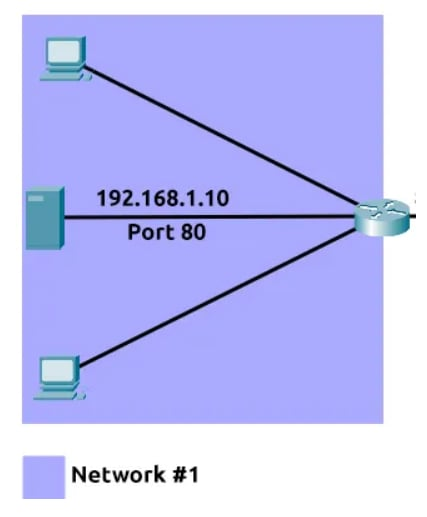
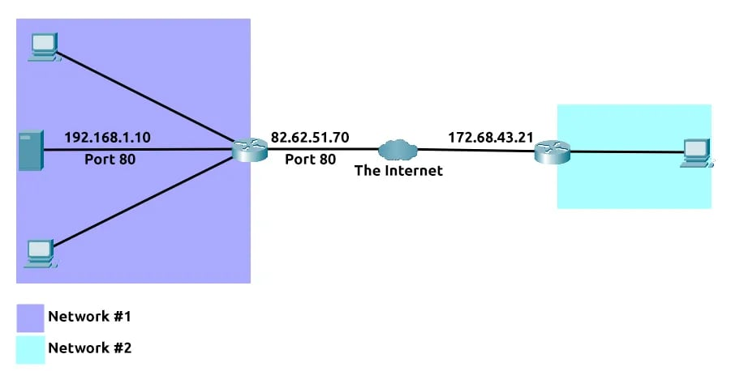
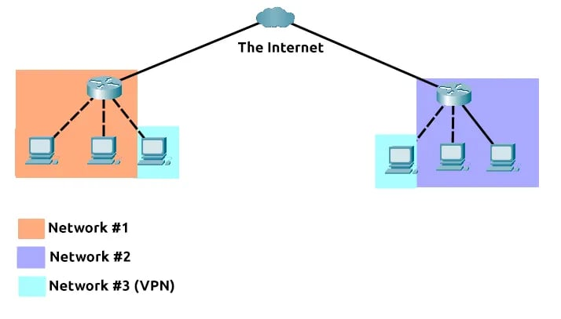

# **I, Introduction to Port Forwarding**
Cổng Chuyển tiếp cổng là một thành phần thiết yếu trong việc kết nối các ứng dụng và dịch vụ với Internet. Nếu không có chuyển tiếp cổng, các ứng dụng và dịch vụ như máy chủ web chỉ khả dụng cho các thiết bị trong cùng một mạng trực tiếp.

Hãy lấy mạng bên dưới làm ví dụ. Trong mạng này, máy chủ có địa chỉ IP là "192.168.1.10" chạy một máy chủ web trên cổng 80. Chỉ có hai máy tính khác trong mạng này mới có thể truy cập được (đây được gọi là mạng nội bộ ).

Nếu người quản trị muốn trang web có thể truy cập được cho công chúng (sử dụng Internet), họ sẽ phải triển khai chuyển tiếp cổng, như trong sơ đồ bên dưới:

Với thiết kế này, Mạng số 2 hiện có thể truy cập máy chủ web đang chạy trên Mạng số 1 bằng cách sử dụng địa chỉ IP công khai của Mạng số 1 (82.62.51.70). Chuyển tiếp cổng được cấu hình tại bộ định tuyến của mạng.

# **II, Firewalls 101**
Tường lửa là một thiết bị trong mạng, chịu trách nhiệm xác định lưu lượng nào được phép vào và ra. Hãy hình dung tường lửa như một lớp bảo mật biên giới cho mạng. Quản trị viên có thể cấu hình tường lửa để cho phép hoặc từ chối lưu lượng vào hoặc ra khỏi mạng dựa trên nhiều yếu tố như:
* Lưu lượng truy cập đến từ đâu? (tường lửa có được yêu cầu chấp nhận/từ chối lưu lượng truy cập từ một mạng cụ thể không?)
* Lưu lượng truy cập đang đi đâu? (tường lửa có được yêu cầu chấp nhận/từ chối lưu lượng truy cập đến một mạng cụ thể không?)
* Lưu lượng truy cập đến cổng nào? (tường lửa có được yêu cầu chấp nhận/từ chối lưu lượng truy cập đến cổng 80 không?)
* Lưu lượng truy cập đang sử dụng giao thức nào? (tường lửa có được yêu cầu chấp nhận/từ chối lưu lượng truy cập UDP, TCP hay cả hai không?)
Tường lửa thực hiện kiểm tra gói tin để xác định câu trả lời cho những câu hỏi này.

Tường lửa có đủ mọi hình dạng và kích cỡ. Từ các phần cứng chuyên dụng (thường thấy trong các mạng lớn như doanh nghiệp) có thể xử lý khối lượng dữ liệu lớn đến các bộ định tuyến dân dụng (như ở nhà bạn!) hoặc phần mềm như Snort , tường lửa có thể được phân loại thành 2 đến 5 loại.

# **III, VPN Basics**
Kiến thức cơ bản về VPN Mạng riêng ảo (hay gọi tắt là VPN ) là công nghệ cho phép các thiết bị trên các mạng riêng biệt giao tiếp an toàn bằng cách tạo một đường dẫn chuyên dụng giữa chúng qua Internet (được gọi là đường hầm ). Các thiết bị được kết nối trong đường hầm này sẽ tạo thành mạng riêng của chúng.

Ví dụ, chỉ các thiết bị trong cùng một mạng (chẳng hạn như trong một doanh nghiệp) mới có thể giao tiếp trực tiếp. Tuy nhiên, VPN cho phép kết nối hai văn phòng. Hãy xem sơ đồ bên dưới, trong đó có ba mạng:

Các thiết bị được kết nối trên Mạng số 3 vẫn là một phần của Mạng số 1 và Mạng số 2 nhưng cũng hình thành cùng nhau để tạo thành một mạng riêng (Mạng số 3) mà chỉ các thiết bị được kết nối qua VPN này mới có thể giao tiếp.

