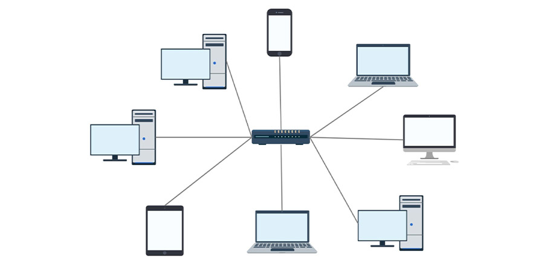
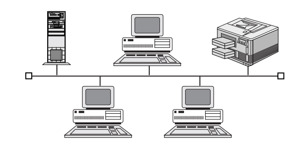
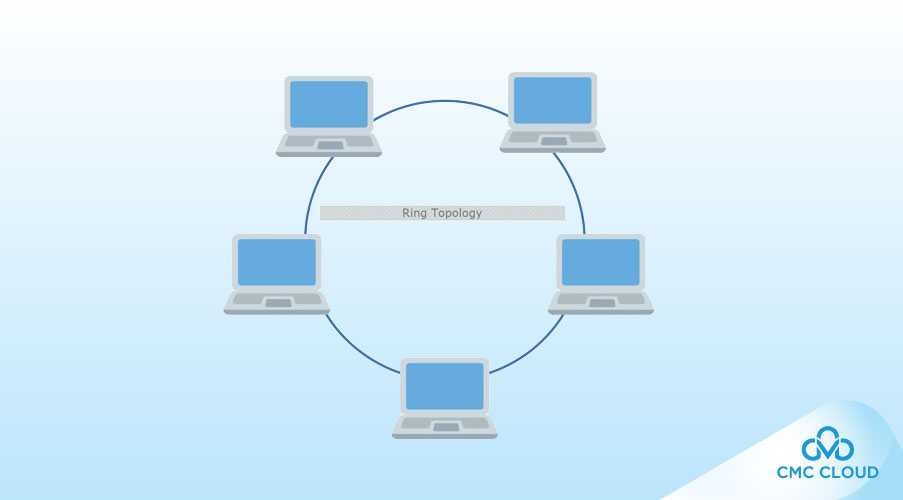
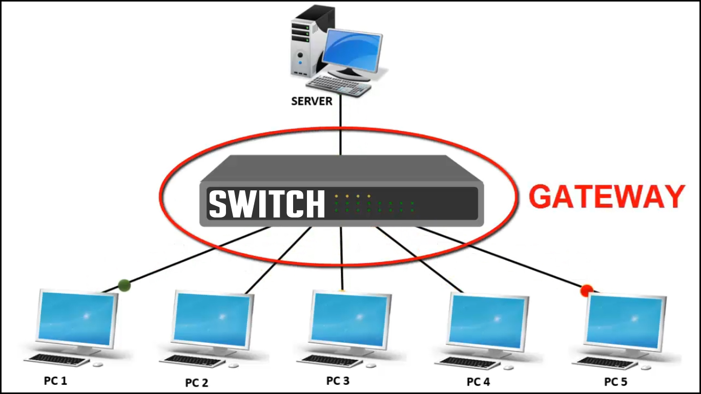
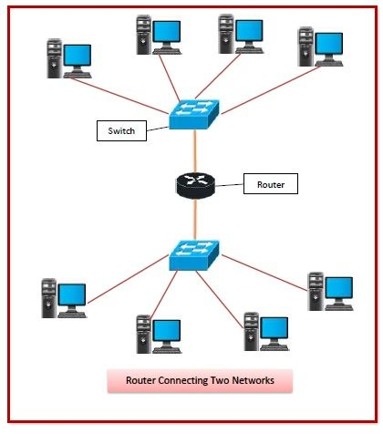
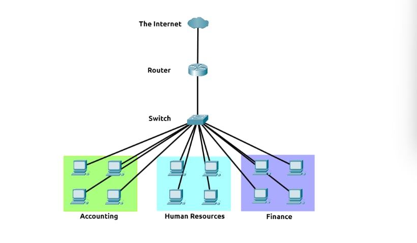

# **I, Introducing LAN Topologies**
#### **Local Area Network (LAN) Topologies**
###### **Star Topology**
Tiền đề chính của cấu trúc mạng hình sao là các thiết bị được kết nối riêng lẻ thông qua một thiết bị mạng trung tâm như switch hoặc hub. Cấu trúc mạng này phổ biến nhất hiện nay nhờ độ tin cậy và khả năng mở rộng – bất chấp chi phí.

Bất kỳ thông tin nào được gửi đến một thiết bị trong cấu trúc này đều được gửi qua thiết bị trung tâm mà nó kết nối.

**Ưu điểm** :
* Khả năng mở rộng cao nghĩa là việc bổ sung thêm thiết bị khi nhu cầu mạng tăng lên rất dễ dàng .

**Nhược điểm** :
* Do cần nhiều cáp hơn và phải mua thiết bị mạng chuyên dụng cho cấu trúc mạng này, nên nó đắt hơn bất kỳ cấu trúc mạng nào khác 
* Việc khắc phục sự cố trở nên khó khăn hơn nhiều 
* Cấu trúc mạng hình sao vẫn dễ bị lỗi - mặc dù đã được giảm thiểu

###### **Bus Topology**
Loại kết nối này dựa trên một kết nối duy nhất được gọi là cáp xương sống . Cấu trúc liên kết này tương tự như lá cây ở chỗ các thiết bị (lá) bắt nguồn từ vị trí các nhánh trên cáp này.

**Ưu điểm** :
* cấu trúc dễ thiết lập và tiết kiệm chi phí

**Nhược Điểm** :
* Do tất cả dữ liệu được truyền đến từng thiết bị đều đi trên cùng một cáp, nên việc truyền dữ liệu rất dễ bị chậm và tắc nghẽn nếu các thiết bị trong cùng một cấu trúc mạng yêu cầu dữ liệu cùng lúc.
* Thiếu dự phòng trong trường hợp xảy ra sự cố . Nhược điểm này là do chỉ có một điểm lỗi duy nhất trên cáp xương sống. Nếu cáp này bị đứt, các thiết bị không thể tiếp tục nhận hoặc truyền dữ liệu trên bus.

###### **Ring Topology**
Cấu trúc vòng (còn được gọi là cấu trúc token) có một số điểm tương đồng. Các thiết bị như máy tính được kết nối trực tiếp với nhau tạo thành một vòng lặp , nghĩa là cần ít cáp và ít phụ thuộc vào phần cứng chuyên dụng như trong cấu trúc hình sao. 

Cấu trúc vòng hoạt động bằng cách gửi dữ liệu qua vòng lặp cho đến khi đến được thiết bị đích, sử dụng các thiết bị khác dọc theo vòng lặp để chuyển tiếp dữ liệu. Điều thú vị là, một thiết bị sẽ chỉ gửi dữ liệu đã nhận từ một thiết bị khác trong cấu trúc này nếu nó không có dữ liệu nào để gửi. Nếu thiết bị tình cờ có dữ liệu cần gửi, nó sẽ gửi dữ liệu của chính nó trước khi gửi dữ liệu từ thiết bị khác.

**Ưu điểm** :
* Vì dữ liệu chỉ có một hướng di chuyển qua cấu trúc mạng này, nên việc khắc phục sự cố phát sinh khá dễ dàng. Tuy nhiên, đây cũng là một con dao hai lưỡi vì nó không phải là cách hiệu quả để dữ liệu di chuyển qua mạng, vì dữ liệu có thể phải đi qua nhiều thiết bị trước khi đến được thiết bị mong muốn.
* Cấu trúc vòng ít bị tắc nghẽn hơn

**Nhược điểm** : 
* Một sự cố như đứt cáp hoặc hỏng thiết bị sẽ khiến toàn bộ mạng bị gián đoạn

###### **Switch** :
Bộ chuyển mạch (switch) là thiết bị chuyên dụng trong một mạng, được thiết kế để kết nối nhiều thiết bị khác nhau như máy tính, máy in hoặc bất kỳ thiết bị nào khác có khả năng kết nối mạng bằng Ethernet. Các thiết bị này được cắm vào cổng của bộ chuyển mạch. Bộ chuyển mạch thường được tìm thấy trong các mạng lớn hơn như doanh nghiệp, trường học hoặc các mạng có quy mô tương tự, nơi có nhiều thiết bị cần kết nối vào mạng. Bộ chuyển mạch có thể kết nối một số lượng lớn thiết bị bằng cách sử dụng các cổng 4, 8, 16, 24, 32 và 64 để các thiết bị có thể kết nối vào.

Switch hiệu quả hơn nhiều so với các thiết bị tương tự kém hiệu quả hơn (hub/repeater) . Switch theo dõi thiết bị nào được kết nối với cổng nào. Nhờ đó, khi nhận được một gói tin, thay vì lặp lại gói tin đó đến từng cổng như hub, nó chỉ gửi gói tin đến đích mong muốn, do đó giảm lưu lượng mạng.

Cả bộ chuyển mạch và bộ định tuyến đều có thể được kết nối với nhau. Khả năng này làm tăng tính dự phòng (độ tin cậy) của mạng bằng cách thêm nhiều đường dẫn cho dữ liệu đi qua. Nếu một đường dẫn bị hỏng, có thể sử dụng đường dẫn khác. Mặc dù điều này có thể làm giảm hiệu suất tổng thể của mạng do các gói tin mất nhiều thời gian hơn để di chuyển, nhưng không có thời gian chết — một cái giá nhỏ phải trả so với phương án thay thế.
###### **Router** : 
Nhiệm vụ của bộ định tuyến là kết nối các mạng và truyền dữ liệu giữa chúng . Nó thực hiện điều này bằng cách sử dụng định tuyến (do đó có tên là bộ định tuyến!).

Định tuyến là nhãn được gán cho quá trình dữ liệu di chuyển qua các mạng. Định tuyến liên quan đến việc tạo ra một đường dẫn giữa các mạng để dữ liệu có thể được truyền tải thành công.

Định tuyến hữu ích khi các thiết bị được kết nối theo nhiều đường dẫn, chẳng hạn như trong sơ đồ ví dụ bên dưới.

# **II, Sơ lược về mạng con** 
**Chia mạng con là thuật ngữ dùng để chỉ việc chia một mạng thành các mạng nhỏ hơn, thu nhỏ hơn bên trong chính nó**. Hãy tưởng tượng việc này giống như việc chia một chiếc bánh cho bạn bè. Chỉ có một lượng bánh nhất định, nhưng ai cũng muốn có một miếng. Chia mạng con là việc bạn quyết định ai sẽ được chia miếng nào và giữ lại một miếng bánh tượng trưng này.

Lấy một doanh nghiệp làm ví dụ; bạn sẽ có nhiều phòng ban khác nhau như:
* Kế toán
* Tài chính
* Nguồn nhân lực

Mặc dù bạn biết cách gửi thông tin đến đúng bộ phận trong thực tế, nhưng các mạng cũng cần biết điều này. Quản trị viên mạng sử dụng phương pháp chia mạng con để phân loại và chỉ định các phần cụ thể của mạng nhằm phản ánh điều này.

Việc chia mạng con được thực hiện bằng cách chia nhỏ số lượng máy chủ có thể kết nối trong mạng, được biểu thị bằng một con số gọi là mặt nạ mạng con.

Như chúng ta đã biết, một địa chỉ IP được tạo thành từ bốn phần gọi là octet . Tương tự như vậy, mặt nạ mạng con cũng được biểu diễn dưới dạng một dãy bốn byte (32 bit), từ 0 đến 255 (0-255).

Mạng con sử dụng địa chỉ IP theo ba cách khác nhau:
* Xác định địa chỉ mạng
* Xác định địa chỉ máy chủ
* Xác định cổng mặc định

Phân mạng mang lại nhiều lợi ích, bao gồm:
* Hiệu quả
* Bảo vệ
* Kiểm soát hoàn toàn

# **III, ARP Protocol**
Giao thức ARP  hay  viết tắt là Giao thức phân giải  địa  chỉ  là công nghệ chịu trách nhiệm cho phép các thiết bị tự nhận dạng trên mạng.

Nói một cách đơn giản, giao thức ARP cho phép một thiết bị liên kết địa chỉ MAC của nó với một địa chỉ IP trên mạng . Mỗi thiết bị trên mạng sẽ lưu giữ nhật ký về các địa chỉ MAC được liên kết với các thiết bị khác.

Khi các thiết bị muốn giao tiếp với nhau, chúng sẽ gửi một thông điệp phát sóng đến toàn bộ mạng để tìm kiếm thiết bị cụ thể. Các thiết bị có thể sử dụng giao thức ARP để tìm địa chỉ MAC (và do đó là mã định danh vật lý) của thiết bị cần giao tiếp.

**Cách hoạt động**
Mỗi thiết bị trong mạng đều có một sổ cái để lưu trữ thông tin, được gọi là bộ nhớ đệm. Trong giao thức ARP, bộ nhớ đệm này lưu trữ mã định danh của các thiết bị khác trên mạng.

Để ánh xạ hai mã định danh này với nhau (địa chỉ IP và địa chỉ MAC), giao thức ARP gửi hai loại thông báo:
* Yêu cầu ARP
* Trả lời ARP

Khi một  yêu cầu ARP  được gửi đi, một thông báo sẽ được phát đến mọi thiết bị khác mà thiết bị đó tìm thấy trên mạng, hỏi xem địa chỉ MAC của thiết bị có khớp với địa chỉ IP được yêu cầu hay không. Nếu thiết bị có địa chỉ IP được yêu cầu, một  phản hồi ARP  sẽ được gửi về thiết bị ban đầu để xác nhận. Thiết bị ban đầu sẽ ghi nhớ thông tin này và lưu trữ trong bộ nhớ đệm (một mục ARP). 

# **IV, DHCP Protocol**
Địa chỉ IP có thể được gán thủ công bằng cách nhập trực tiếp vào thiết bị, hoặc tự động, phổ biến nhất là sử dụng máy  chủ DHCP  ( Giao thức Cấu hình  Máy chủ  Động )  . Khi một thiết bị kết nối với mạng, nếu chưa được gán địa chỉ IP thủ công, nó sẽ gửi một yêu cầu (DHCP Discover) để kiểm tra xem có máy chủ DHCP nào trên mạng hay không. Máy chủ DHCP sau đó sẽ phản hồi lại bằng một địa chỉ IP mà thiết bị có thể sử dụng (DHCP Offer). Thiết bị sau đó sẽ gửi một phản hồi xác nhận rằng nó muốn Địa chỉ IP được cung cấp (DHCP Request), và cuối cùng, máy chủ DHCP sẽ gửi một phản hồi xác nhận việc này đã hoàn tất, và thiết bị có thể bắt đầu sử dụng Địa chỉ IP (DHCP ACK).

