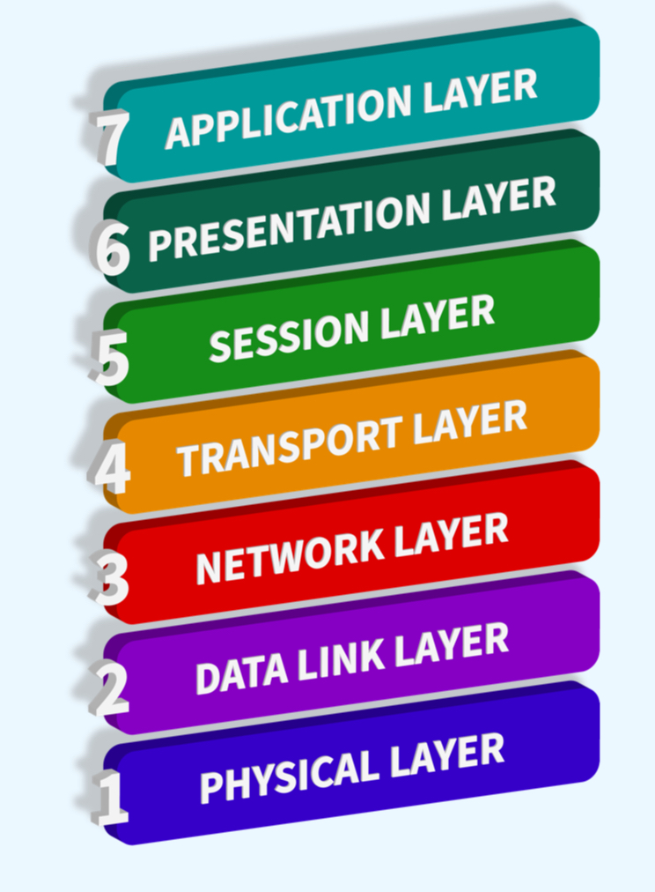
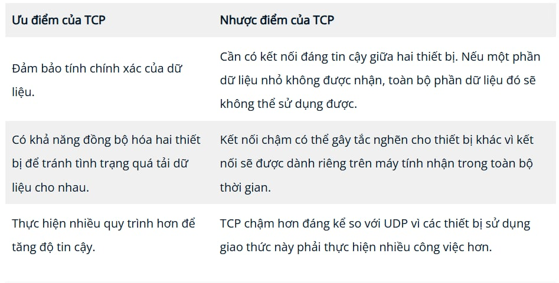
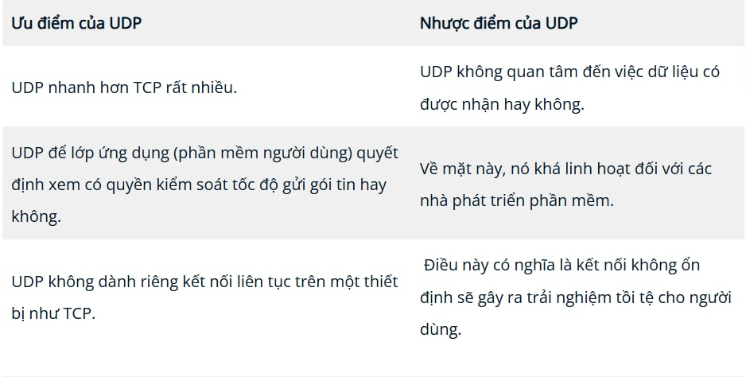

# **I, Mô hình OSI là gì**
Mô  hình OSI  (Open Systems Interconnection Model hay  Mô hình kết nối hệ thống )  là một mô  hình cơ bản tuyệt đối được sử dụng trong mạng. Mô hình quan trọng này cung cấp một khuôn khổ quy định cách thức tất cả các thiết bị mạng sẽ gửi, nhận và diễn giải dữ liệu.

Một trong những lợi ích chính của mô hình OSI là các thiết bị có thể có chức năng và thiết kế khác nhau trên cùng một mạng khi giao tiếp với các thiết bị khác. Dữ liệu được gửi qua mạng tuân theo tính đồng nhất của mô hình OSI có thể được các thiết bị khác hiểu được.

Mô hình OSI bao gồm bảy tầng được minh họa trong sơ đồ bên dưới. Mỗi tầng có một tập hợp trách nhiệm khác nhau và được sắp xếp từ Tầng 7 đến Tầng 1.

# **II, Layer 7 – Application**
Tầng ứng dụng của mô hình OSI là tầng mà bạn sẽ quen thuộc nhất. Sự quen thuộc này là do tầng ứng dụng là tầng chứa các giao thức và quy tắc để xác định cách người dùng tương tác với dữ liệu được gửi hoặc nhận.

Các ứng dụng hàng ngày như máy khách email, trình duyệt hoặc phần mềm duyệt máy chủ tệp như FileZilla cung cấp giao diện người dùng đồ họa (GUI) thân thiện  để người dùng  tương tác với dữ  liệu được gửi hoặc nhận  . Các giao thức khác bao gồm  DNS  ( Hệ thống tên miền  ), là cách địa chỉ trang web được chuyển đổi thành địa chỉ IP.

Protocols and Standards : HTTP, FTP, DNS, POP3, SMTP, IMAP

# **III, Layer 6 - Presentation**
Tầng 6 của mô hình OSI là tầng mà quá trình chuẩn hóa bắt đầu diễn ra. Vì các nhà phát triển phần mềm có thể phát triển bất kỳ phần mềm nào, chẳng hạn như ứng dụng email, theo những cách khác nhau, nên dữ liệu vẫn cần được xử lý theo cùng một cách — bất kể phần mềm hoạt động như thế nào.

Lớp này hoạt động như một trình biên dịch dữ liệu đến và đi từ lớp ứng dụng (lớp 7). Máy tính nhận cũng sẽ hiểu dữ liệu được gửi đến máy tính ở một định dạng được định sẵn ở một định dạng khác. Ví dụ: khi bạn gửi email, người dùng kia có thể có một trình email khác gửi cho bạn, nhưng nội dung của email vẫn cần phải hiển thị giống như vậy.

Các tính năng bảo mật như mã hóa dữ liệu (như HTTPS khi truy cập trang web an toàn) xảy ra ở lớp này.

Protocols and Standards : Unicode, MIME, JPEG, PNG, MPEG

# **IV, Layer 5 - Session**
Sau khi dữ liệu đã được dịch hoặc định dạng chính xác từ lớp trình bày (lớp 6), lớp phiên (lớp 5) sẽ bắt đầu tạo kết nối đến máy tính khác mà dữ liệu được gửi đến. Khi kết nối được thiết lập, một phiên sẽ được tạo. Khi kết nối này hoạt động, phiên cũng hoạt động.

Lớp phiên (lớp 5) đồng bộ hóa hai máy tính để đảm bảo chúng hoạt động trên cùng một nền tảng trước khi dữ liệu được gửi và nhận. Sau khi các bước kiểm tra này được thực hiện, lớp phiên sẽ bắt đầu chia dữ liệu được gửi thành các khối dữ liệu nhỏ hơn và bắt đầu gửi từng khối (gói) dữ liệu này. Việc chia nhỏ này rất có lợi vì nếu kết nối bị mất, chỉ những khối dữ liệu chưa được gửi mới phải được gửi lại — chứ không phải toàn bộ dữ liệu (giống như việc tải tệp lưu trong trò chơi điện tử).

Điều đáng chú ý là các phiên là duy nhất — nghĩa là dữ liệu không thể di chuyển qua các phiên khác nhau mà chỉ có thể di chuyển qua từng phiên.

Protocols and Standards : NFS, RPC

# **V, Layer 4 - Transport**
Tầng 4 của mô hình OSI đóng vai trò quan trọng trong việc truyền dữ liệu qua mạng và có thể hơi khó hiểu. Khi dữ liệu được gửi giữa các thiết bị, nó tuân theo một trong hai giao thức khác nhau được quyết định dựa trên một số yếu tố:
* Giao thức TCP
* UDP

Hãy bắt đầu với TCP. Giao  thức Điều khiển  Truyền tải (  TCP ) . Đúng như tên gọi, giao thức này được thiết kế với mục tiêu hướng đến độ tin cậy và đảm bảo. Giao thức này duy trì kết nối liên tục giữa hai thiết bị trong suốt thời gian dữ liệu được gửi và nhận.

Không chỉ vậy, TCP còn tích hợp tính năng kiểm tra lỗi vào thiết kế của nó. Kiểm tra lỗi là cách TCP đảm bảo dữ liệu được gửi từ các khối nhỏ trong lớp phiên (lớp 5) sau đó đã được nhận và lắp ráp lại theo cùng một thứ tự.

Chúng ta hãy tóm tắt những ưu điểm và nhược điểm của TCP trong bảng dưới đây:

TCP được sử dụng cho các tình huống như chia sẻ tệp, duyệt internet hoặc gửi email. Việc sử dụng này là do các dịch vụ này yêu cầu dữ liệu phải chính xác và đầy đủ (chỉ có một nửa tệp là không tốt!).

Bây  giờ , hãy chuyển sang   Giao thức UDP (hay  viết tắt là UDP ). Giao thức này không tiên tiến bằng giao thức TCP. Nó không sở hữu nhiều tính năng mà TCP cung cấp, chẳng hạn như kiểm tra lỗi và  độ tin cậy. Trên thực tế, bất kỳ dữ liệu nào được gửi qua UDP đều được gửi đến máy tính, bất kể nó có đến được máy tính hay không. Không có sự đồng bộ hóa hoặc bảo đảm nào giữa hai thiết bị; chỉ có thể hy vọng mọi chuyện sẽ tốt đẹp, và cầu mong điều tốt đẹp sẽ đến.

Mặc dù điều này nghe có vẻ bất lợi, nhưng nó cũng có những ưu điểm mà chúng tôi sẽ trình bày trong bảng dưới đây:

UDP hữu ích trong các trường hợp dữ liệu được gửi đi chỉ là những phần nhỏ. Ví dụ, các giao thức được sử dụng để phát hiện thiết bị ( ARP  và  DHCP  mà chúng ta đã thảo luận trong  Phòng 2 – Giới thiệu về mạng LAN)  hoặc các tệp lớn hơn như phát trực tuyến video (trong đó một phần video bị vỡ hạt cũng không sao. Điểm ảnh chỉ là những phần dữ liệu bị mất!)

Protocols and Standards : 	UDP, TCP

# **VI, Layer 3 - Network**
Tầng thứ ba của mô hình OSI (tầng mạng) là nơi diễn ra quá trình định tuyến và tái lắp ráp dữ liệu (từ những khối dữ liệu nhỏ này đến khối dữ liệu lớn hơn). Trước hết, định tuyến chỉ đơn giản là xác định đường dẫn tối ưu nhất để các khối dữ liệu này được gửi đi.

Trong khi một số giao thức ở tầng này xác định chính xác đường dẫn "tối ưu" mà dữ liệu nên đi qua để đến được thiết bị, chúng ta chỉ nên biết về sự tồn tại của chúng ở giai đoạn này của mô-đun mạng. Tóm lại, các giao thức này bao gồm  OSPF  ( Đường dẫn ngắn  nhất  đầu tiên )  và  RIP  ( Giao thức  thông  tin định tuyến ). Các yếu tố quyết định tuyến đường được chọn được xác định bởi:
* Đường dẫn nào là ngắn nhất? Tức là đường dẫn có số lượng thiết bị ít nhất mà gói tin cần phải đi qua.
* Đường dẫn nào là đáng tin cậy nhất? Có gói tin nào đã bị mất trên đường dẫn đó trước đây không?

Đường dẫn nào có kết nối vật lý nhanh hơn? Ví dụ: một đường dẫn sử dụng kết nối đồng (chậm hơn) hay cáp quang (nhanh hơn đáng kể)?
Ở lớp này, mọi thứ được xử lý thông qua địa chỉ IP, chẳng hạn như 192.168.1.100. Các thiết bị như bộ định tuyến có khả năng phân phối gói tin bằng địa chỉ IP được gọi là thiết bị Lớp 3 — vì chúng có khả năng hoạt động ở lớp thứ ba của mô hình OSI.

Protocols and Standards : IP, ICMP, IPSec

# **VII, Layer 2 - Data Link**
Lớp liên kết dữ liệu tập trung vào việc định địa chỉ vật lý cho quá trình truyền tải. Nó nhận một gói tin từ lớp mạng (bao gồm địa chỉ IP của máy tính từ xa) và thêm địa chỉ  MAC  (Media Access Control - Kiểm soát Truy cập Phương tiện) vật lý của điểm cuối nhận. Bên trong mỗi máy tính được kết nối mạng đều có một  Card Giao diện Mạng ( NIC  ) đi kèm với một địa chỉ MAC duy nhất để nhận dạng.

Địa chỉ MAC được nhà sản xuất thiết lập và ghi trực tiếp vào thẻ; chúng không thể thay đổi — mặc dù có thể bị giả mạo. Khi thông tin được gửi qua mạng, thực ra chính địa chỉ vật lý mới được sử dụng để xác định chính xác nơi gửi thông tin.

Ngoài ra, lớp liên kết dữ liệu còn có nhiệm vụ trình bày dữ liệu theo định dạng phù hợp để truyền tải.

Protocols and Standards : Ethernet (802.3), WiFi (802.11)

# **VIII, Layer 1 - Physical**
Tầng này là một trong những tầng dễ hiểu nhất. Nói một cách đơn giản, tầng này tham chiếu đến các thành phần vật lý của phần cứng được sử dụng trong mạng và là tầng thấp nhất mà bạn sẽ tìm thấy. Các thiết bị sử dụng tín hiệu điện để truyền dữ liệu giữa các thiết bị với nhau theo hệ nhị phân (1 và 0).

Protocols and Standards : lectrical, optical, and wireless signals