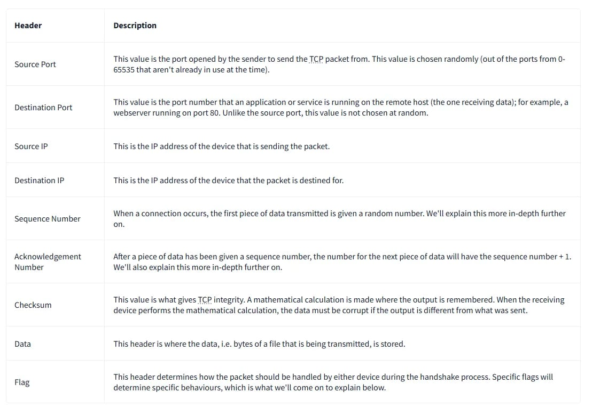
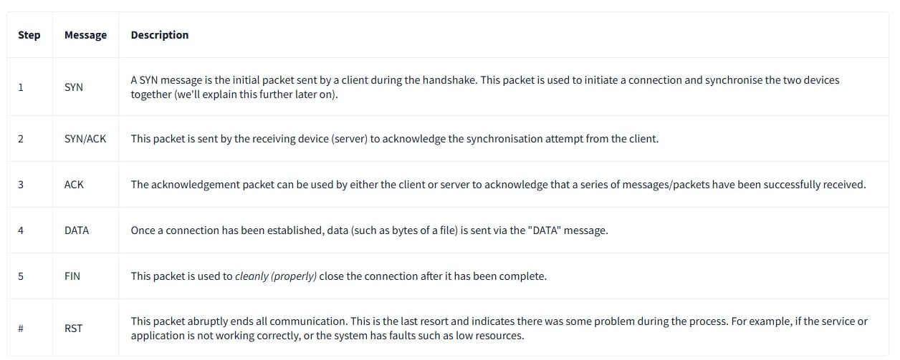
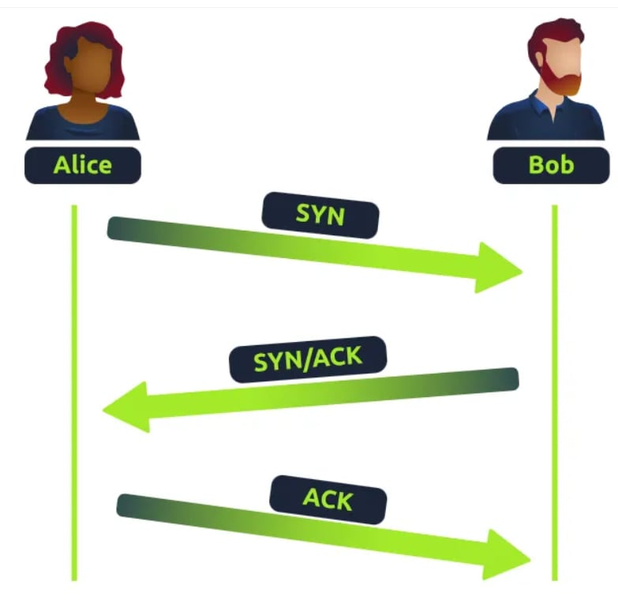
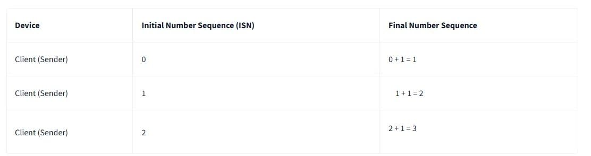
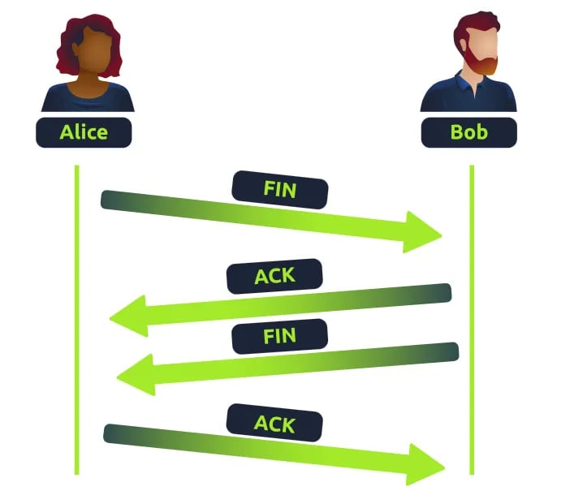
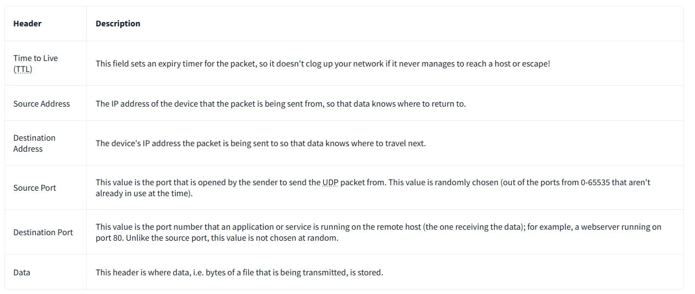
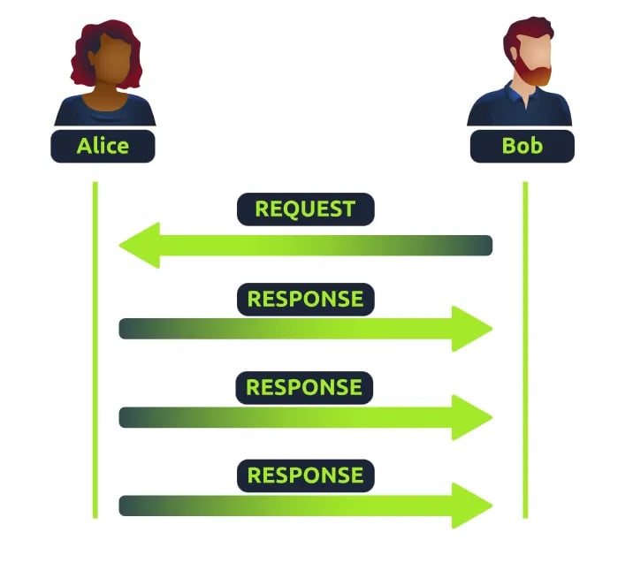

# **I, Gói và Khung là gì**
Gói tin và khung dữ liệu là hai cách mô tả các loại đơn vị dữ liệu cụ thể được sử dụng trong mạng. Khung dữ liệu (tương tự như 'khung Ethernet') được sử dụng ở lớp Liên kết Dữ liệu để truyền dữ liệu trên mạng. Gói tin được sử dụng ở lớp Mạng để truyền dữ liệu giữa các mạng.

Các gói tin và khung đều bao gồm hai phần:
1) Một tiêu đề .
2) Tải trọng dữ liệu .

Tiêu đề chứa thông tin hậu cần và kỹ thuật giúp dữ liệu đến đúng đích (và ngược lại) và kiểm tra xem dữ liệu có được nhận đúng cách hay không.

Các trường tiêu đề phổ biến là: TTL (thời gian tồn tại), tổng kiểm tra (kiểm tra tính toàn vẹn của dữ liệu) và địa chỉ nguồn và đích (có thể là địa chỉ MAC trong một khung hoặc địa chỉ IP trong một gói tin).

# **II, TCP/IP (The Three-Way Handshake)**
TCP (hay gọi tắt là Giao thức điều khiển truyền tải ) là một trong những quy tắc được sử dụng trong mạng.

Giao thức này rất giống với mô hình OSI mà chúng ta đã thảo luận ở phòng ba của học phần này. Giao thức TCP/IP bao gồm bốn tầng và có thể được coi là phiên bản tóm tắt của mô hình OSI. Các tầng này là:
* Ứng dụng
* Chuyên chở
* Internet
* Giao diện mạng

Rất giống với cách thức hoạt động của mô hình OSI, thông tin được thêm vào từng lớp của mô hình TCP khi dữ liệu (hoặc gói tin) đi qua. Như bạn có thể nhớ, quá trình này được gọi là đóng gói (encapsulation) — ngược lại với quá trình này là giải đóng gói (decapsulation).

Một đặc điểm nổi bật của TCP là nó dựa trên kết nối , nghĩa là TCP phải thiết lập kết nối giữa máy khách và thiết bị đóng vai trò là máy chủ trước khi dữ liệu được gửi.

Nhờ đó, TCP đảm bảo mọi dữ liệu được gửi đi đều được nhận ở đầu bên kia. Quá trình này được gọi là bắt tay ba bước.

Các gói tin TCP chứa nhiều phần thông tin khác nhau được gọi là tiêu đề (header), được thêm vào từ quá trình đóng gói. Hãy cùng giải thích một số tiêu đề quan trọng trong bảng dưới đây:

Tiếp theo, chúng ta sẽ thảo luận về Bắt tay ba chiều — thuật ngữ được đặt cho quy trình được sử dụng để thiết lập kết nối giữa hai thiết bị. Bắt tay ba chiều giao tiếp bằng một vài thông điệp đặc biệt — bảng dưới đây nêu bật những thông điệp chính:

Sơ đồ bên dưới cho thấy quá trình bắt tay ba chiều thông thường giữa Alice và Bob. Trong thực tế, quá trình này sẽ diễn ra giữa hai thiết bị.

Bất kỳ dữ liệu nào được gửi đi đều được gán một chuỗi số ngẫu nhiên và được tái tạo lại bằng chuỗi số này, tăng dần theo đơn vị 1. Cả hai máy tính phải thống nhất về cùng một chuỗi số để dữ liệu được gửi đi theo đúng thứ tự. Thứ tự này được thống nhất qua ba bước:

1. SYN — Client: Đây là Số thứ tự ban đầu (ISN) của tôi để SYN chronise với (0)
2. SYN/ACK — Máy chủ: Đây là Số thứ tự ban đầu (ISN) của tôi để SYN đồng bộ hóa với (5.000) và tôi xác nhận chuỗi số ban đầu của bạn (0)
3. ACK — Khách hàng: Tôi xác nhận Số thứ tự ban đầu (ISN) của bạn là (5.000), đây là một số dữ liệu là ISN+1 (0 + 1) của tôi

###### **TCP Đóng kết nối** :

Hãy cùng giải thích nhanh quy trình TCP đóng kết nối. Đầu tiên, TCP sẽ đóng kết nối khi một thiết bị xác định rằng thiết bị kia đã nhận được toàn bộ dữ liệu thành công.

Vì TCP dành riêng tài nguyên hệ thống trên thiết bị nên cách tốt nhất là đóng kết nối TCP càng sớm càng tốt.

Để bắt đầu đóng kết nối TCP, thiết bị sẽ gửi gói tin "FIN" đến thiết bị kia. Tất nhiên, với TCP, thiết bị kia cũng sẽ phải xác nhận gói tin này.

Chúng ta hãy trình bày quá trình này bằng cách sử dụng Alice và Bob như đã trình bày trước đó.

# **III, UDP/IP** 
Giao thức UDP ( User Data Atagram Protocol ) là một giao thức khác được sử dụng để truyền dữ liệu giữa các thiết bị.

Không giống như giao thức TCP, UDP là giao thức không trạng thái , không yêu cầu kết nối liên tục giữa hai thiết bị để gửi dữ liệu. Ví dụ, không có bắt tay ba chiều, cũng không có bất kỳ sự đồng bộ hóa nào giữa hai thiết bị.

Như đã đề cập, không có quy trình nào diễn ra khi thiết lập kết nối giữa hai thiết bị. Điều này có nghĩa là không quan tâm đến việc dữ liệu có được nhận hay không, và không có các biện pháp bảo vệ như TCP, chẳng hạn như tính toàn vẹn dữ liệu.

Các gói tin UDP đơn giản hơn nhiều so với các gói tin TCP và có ít tiêu đề hơn. Tuy nhiên, cả hai giao thức đều chia sẻ một số tiêu đề chuẩn, được chú thích trong bảng dưới đây:

Tiếp theo, chúng ta sẽ thảo luận về sự khác biệt giữa quy trình kết nối qua UDP và TCP. Chúng ta nên nhớ rằng UDP là giao thức phi trạng thái . Không có xác nhận nào được gửi trong quá trình kết nối.

Sơ đồ bên dưới cho thấy kết nối UDP bình thường giữa Alice và Bob. Trong thực tế, kết nối này sẽ diễn ra giữa hai thiết bị.

