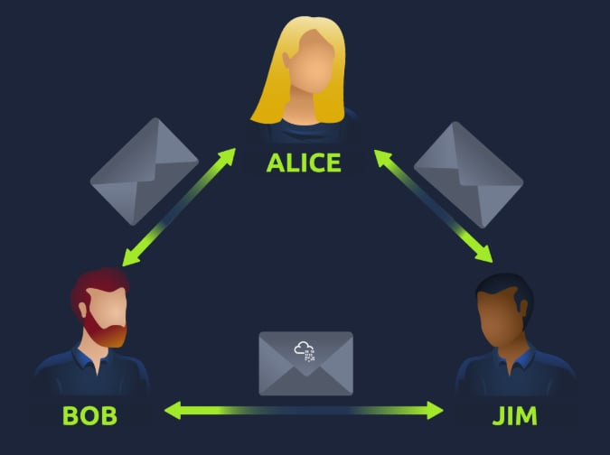

# **What is Networking?**

Mạng lưới đơn giản là những thứ được kết nối với nhau. Ví dụ, vòng tròn bạn bè của bạn: tất cả mọi người được kết nối với nhau vì có cùng sở thích, sở thích, kỹ năng và nhiều thứ khác.

Mạng lưới có thể được tìm thấy trong mọi tầng lớp của cuộc sống:

* Hệ thống giao thông công cộng của một thành phố
* Cơ sở hạ tầng như lưới điện quốc gia để cung cấp điện
* Gặp gỡ và chào hỏi hàng xóm của bạn
* Hệ thống bưu chính để gửi thư và bưu kiện
* Nhưng cụ thể hơn, trong điện toán, mạng cũng là một ý tưởng tương tự, chỉ khác là được phân tán đến các thiết bị công nghệ. Lấy điện thoại làm ví dụ; mục đích bạn sở hữu nó là để truy cập mọi thứ. Chúng ta sẽ tìm hiểu cách các thiết bị này giao tiếp với nhau và các quy tắc tuân theo.

Trong điện toán, một mạng lưới có thể được hình thành từ 2 đến hàng tỷ thiết bị. Các thiết bị này bao gồm mọi thứ, từ máy tính xách tay và điện thoại đến camera an ninh, đèn giao thông và thậm chí cả nông nghiệp!

Mạng lưới được tích hợp vào cuộc sống hàng ngày của chúng ta. Dù là thu thập dữ liệu thời tiết, cung cấp điện cho hộ gia đình hay thậm chí xác định ai được quyền ưu tiên trên đường. Vì mạng lưới đã ăn sâu vào đời sống hiện đại, nên nó là một khái niệm thiết yếu cần nắm vững trong an ninh mạng.

# **What is the Internet?**

Internet là một mạng lưới khổng lồ bao gồm rất nhiều mạng lưới nhỏ bên trong nó.

Phiên bản đầu tiên của Internet nằm trong dự án ARPANET vào cuối những năm 1960. Dự án này được Bộ Quốc phòng Hoa Kỳ tài trợ và là mạng lưới đầu tiên được ghi nhận đang hoạt động. Tuy nhiên, phải đến năm 1989, Internet như chúng ta biết mới được Tim Berners-Lee phát minh ra với sự ra đời của World Wide Web ( WWW ) . Mãi đến thời điểm này, Internet mới bắt đầu được sử dụng như một kho lưu trữ và chia sẻ thông tin, giống như ngày nay.

Như đã đề cập trước đó, Internet được tạo thành từ nhiều mạng nhỏ kết nối với nhau. Những mạng nhỏ này được gọi là mạng riêng, trong khi các mạng kết nối những mạng nhỏ này được gọi là mạng công cộng -- hay Internet!  Tóm lại, một mạng có thể thuộc một trong hai loại sau:

* Một mạng lưới riêng tư
* Một mạng lưới công cộng

# **Xác định thiết bị trên mạng**

Để giao tiếp và duy trì trật tự, các thiết bị phải vừa có khả năng nhận dạng vừa có thể nhận diện trên mạng.

Các thiết bị trên mạng rất giống với con người ở chỗ chúng ta có hai cách để được nhận dạng:

* Tên của chúng tôi
* Dấu vân tay của chúng tôi

Giờ đây, chúng ta có thể thay đổi tên thông qua việc đăng ký chứng thư số, nhưng không thể thay đổi dấu vân tay. Mỗi người đều có một bộ dấu vân tay riêng, nghĩa là ngay cả khi họ thay đổi tên, vẫn có một danh tính ẩn sau dấu vân tay đó. Các thiết bị cũng có cùng một đặc điểm: hai phương thức nhận dạng, trong đó một phương thức có thể thẩm thấu. Đó là:

* Địa chỉ IP
* Địa chỉ Kiểm soát truy cập phương tiện (MAC) -- hãy coi nó tương tự như số sê-ri.

#### **Địa chỉ IP**

Tóm lại, địa chỉ IP (hay Giao thức Internet ) có thể được sử dụng như một cách để xác định một máy chủ trên mạng trong một khoảng thời gian nhất định, sau đó địa chỉ IP đó có thể được liên kết với một thiết bị khác mà không cần thay đổi địa chỉ IP.

Địa chỉ IP  là một tập hợp các số được chia thành bốn octet. Giá trị của mỗi octet sẽ được tóm tắt là địa chỉ IP của thiết bị trên mạng. Con số này được tính toán thông qua một kỹ thuật được gọi là định địa chỉ IP và chia mạng con. Điều quan trọng cần hiểu ở đây là địa chỉ IP có thể thay đổi từ thiết bị này sang thiết bị khác nhưng không thể hoạt động đồng thời nhiều hơn một lần trong cùng một mạng.

Địa chỉ IP tuân theo một bộ tiêu chuẩn được gọi là giao thức. Các giao thức này là xương sống của mạng và buộc nhiều thiết bị phải giao tiếp bằng cùng một ngôn ngữ, điều mà chúng ta sẽ đề cập ở phần sau. Tuy nhiên, cần nhớ rằng các thiết bị có thể nằm trên cả mạng riêng và mạng công cộng. Tùy thuộc vào vị trí của chúng, loại địa chỉ IP mà chúng sở hữu sẽ được xác định: địa chỉ IP công cộng hay riêng tư.

Địa chỉ công khai được sử dụng để nhận dạng thiết bị trên Internet, trong khi địa chỉ riêng tư được sử dụng để nhận dạng một thiết bị trong số các thiết bị khác.

Hai thiết bị này sẽ có thể sử dụng địa chỉ IP riêng để giao tiếp với nhau. Tuy nhiên, bất kỳ dữ liệu nào được gửi lên Internet từ một trong hai thiết bị này sẽ được xác định bằng cùng một địa chỉ IP công cộng. Địa chỉ IP công cộng được cung cấp bởi Nhà cung cấp dịch vụ Internet (hoặc ISP) của bạn với một khoản phí hàng tháng.

Khi ngày càng nhiều thiết bị được kết nối, việc tìm kiếm một địa chỉ công cộng chưa được sử dụng ngày càng trở nên khó khăn hơn. Phiên bản của giao thức định địa chỉ Internet được gọi là IPv4, sử dụng hệ thống đánh số gồm 2^32 địa chỉ IP (4,29 tỷ)->thiếu hụt

IPv6 là một phiên bản mới của giao thức định địa chỉ Internet (IPv6) nhằm giải quyết vấn đề này. Mặc dù có vẻ phức tạp hơn, nhưng IPv6 mang lại một số lợi ích sau:

* Hỗ trợ tới 2^128 địa chỉ IP (hơn 340 nghìn tỷ), giải quyết các vấn đề gặp phải với IPv4
* Hiệu quả hơn nhờ phương pháp mới

#### **Địa chỉ MAC**

Tất cả các thiết bị trên mạng đều có một giao diện mạng vật lý, là một bảng vi mạch nằm trên bo mạch chủ của thiết bị. Giao diện mạng này được cấp một địa chỉ duy nhất tại nhà máy nơi nó được sản xuất, được gọi là địa chỉ MAC ( Media Access Control ). Địa chỉ MAC là một số thập lục phân gồm mười hai ký tự ( hệ cơ số mười sáu được sử dụng trong máy tính để biểu diễn số ) được chia thành hai phần và phân cách bằng dấu hai chấm. Các dấu hai chấm này được coi là dấu phân cách. Ví dụ: a4:c3:f0:85:ac:2d . Sáu ký tự đầu tiên đại diện cho công ty sản xuất giao diện mạng, và sáu ký tự cuối cùng là một số duy nhất.

Tuy nhiên, một điều thú vị với địa chỉ MAC là chúng có thể bị làm giả hoặc "giả mạo" trong một quá trình được gọi là giả mạo (spoofing). Việc giả mạo này xảy ra khi một thiết bị mạng giả vờ nhận dạng một thiết bị khác bằng địa chỉ MAC của nó. Khi điều này xảy ra, nó thường có thể phá vỡ các thiết kế bảo mật được triển khai kém, vốn giả định rằng các thiết bị giao tiếp trên mạng là đáng tin cậy. Hãy xem xét tình huống sau: Tường lửa được cấu hình để cho phép mọi giao tiếp đến và đi từ địa chỉ MAC của quản trị viên. Nếu một thiết bị giả mạo hoặc "giả mạo" địa chỉ MAC này, tường lửa sẽ nghĩ rằng nó đang nhận được giao tiếp từ quản trị viên trong khi thực tế không phải vậy.

Các địa điểm như quán cà phê, quán cà phê và khách sạn thường sử dụng kiểm soát địa chỉ MAC khi sử dụng Wi-Fi "Khách" hoặc "Công cộng". Cấu hình này có thể cung cấp dịch vụ tốt hơn, tức là kết nối nhanh hơn với mức giá phải chăng nếu bạn sẵn sàng trả phí cho mỗi thiết bị.

# **Ping(ICMP)**

Ping là một trong những công cụ mạng cơ bản nhất hiện có. Ping sử dụng các gói tin ICMP ( Giao thức tin nhắn điều khiển Internet ) để xác định hiệu suất kết nối giữa các thiết bị, ví dụ: kết nối có tồn tại hoặc đáng tin cậy hay không.

Thời gian các gói tin ICMP di chuyển giữa các thiết bị được đo bằng lệnh ping. Việc đo lường này được thực hiện bằng cách sử dụng gói tin phản hồi ICMP và sau đó là phản hồi ICMP từ thiết bị đích.

