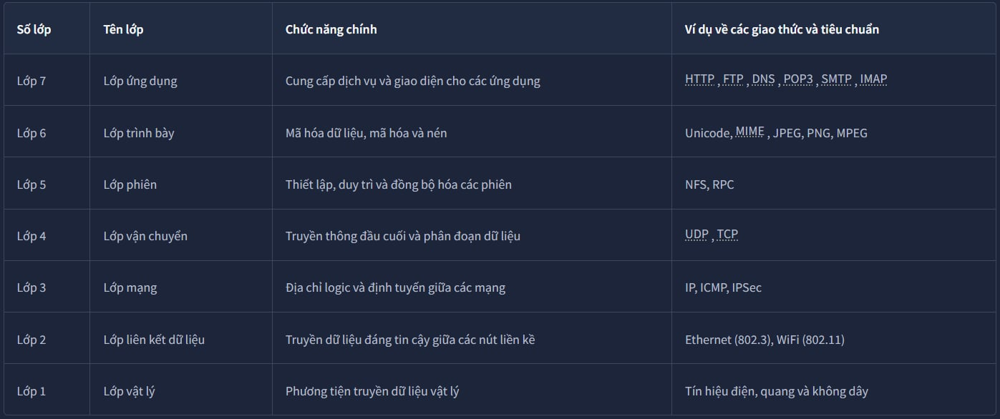
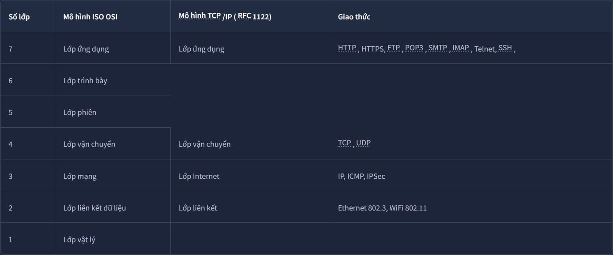

# **I, Mô hình OSI :**

**1. Lớp vật lý (Physical)**

Lớp vật lý, còn được gọi là lớp 1, xử lý kết nối vật lý giữa các thiết bị; bao gồm môi trường truyền dẫn, chẳng hạn như dây dẫn, và định nghĩa của các chữ số nhị phân 0 và 1. Việc truyền dữ liệu có thể được thực hiện thông qua tín hiệu điện, quang hoặc không dây. Do đó, chúng ta cần cáp dữ liệu hoặc ăng-ten, tùy thuộc vào môi trường truyền dẫn vật lý.

Ngoài cáp Ethernet, được hiển thị trong hình minh họa bên dưới, và cáp quang, các ví dụ về môi trường lớp vật lý bao gồm băng tần vô tuyến WiFi, băng tần 2,4 GHz, băng tần 5 GHz và băng tần 6 GHz.

Giao thức : Tín hiệu điện, quang và không dây

**2. Lớp liên kết dữ liệu (Data link)**

Tầng vật lý định nghĩa một phương tiện để truyền tín hiệu. Tầng liên kết dữ liệu, tức là tầng 2, đại diện cho giao thức cho phép truyền dữ liệu giữa các nút trên cùng một phân đoạn mạng. Nói một cách đơn giản hơn, tầng liên kết dữ liệu mô tả thỏa thuận giữa các hệ thống khác nhau trên cùng một phân đoạn mạng về cách thức giao tiếp. Phân đoạn mạng là một nhóm các thiết bị được kết nối mạng sử dụng một phương tiện hoặc kênh chung để truyền thông tin.

Ví dụ, hãy xem xét một văn phòng công ty có mười máy tính được kết nối với một bộ chuyển mạch mạng; đó là một phân đoạn mạng.

Giao thức : 	Ethernet (802.3), WiFi (802.11)

**3. Lớp mạng (Network)**

Lớp mạng, tức là lớp 3, chịu trách nhiệm gửi dữ liệu giữa các mạng khác nhau. Nói một cách kỹ thuật hơn, lớp mạng xử lý việc định địa chỉ và định tuyến logic, tức là tìm đường dẫn để truyền các gói tin mạng giữa các mạng khác nhau.

Trong lớp liên kết dữ liệu, chúng tôi đã đưa ra ví dụ về một văn phòng công ty có mười máy tính, trong đó lớp liên kết dữ liệu chịu trách nhiệm cung cấp kết nối giữa chúng. Giả sử công ty này có nhiều văn phòng phân bổ trên nhiều thành phố, quốc gia, hoặc thậm chí là các châu lục khác nhau. Lớp mạng chịu trách nhiệm kết nối các văn phòng khác nhau lại với nhau.

Giao thức  : IP, ICMP, IPSec

**4. Lớp vận chuyển (Transport)**

Lớp 4, lớp vận chuyển, cho phép giao tiếp đầu cuối giữa các ứng dụng đang chạy trên các máy chủ khác nhau. Trình duyệt web của bạn được kết nối với máy chủ web TryHackMe thông qua lớp vận chuyển, có thể hỗ trợ nhiều chức năng khác nhau như kiểm soát luồng, phân đoạn và sửa lỗi.

Ví dụ về lớp 4 là Giao thức điều khiển truyền dẫn ( TCP ) và Giao thức dữ liệu người dùng ( UDP ).

Giao thức : UDP , TCP

**5. Lớp phiên (Session)**

Lớp phiên chịu trách nhiệm thiết lập, duy trì và đồng bộ hóa giao tiếp giữa các ứng dụng chạy trên các máy chủ khác nhau. Thiết lập phiên nghĩa là khởi tạo giao tiếp giữa các ứng dụng và thương lượng các tham số cần thiết cho phiên. Đồng bộ hóa dữ liệu đảm bảo dữ liệu được truyền theo đúng thứ tự và cung cấp cơ chế phục hồi trong trường hợp lỗi truyền.

Ví dụ về lớp phiên là Hệ thống tệp mạng (NFS) và Gọi thủ tục từ xa (RPC).

Giao thức : 	NFS, RPC

**6. Lớp trình bày (Presentation)**

Lớp trình bày đảm bảo dữ liệu được truyền tải dưới dạng mà lớp ứng dụng có thể hiểu được. Lớp 6 xử lý việc mã hóa, nén và mã hóa dữ liệu. Một ví dụ về mã hóa là mã hóa ký tự, chẳng hạn như ASCII hoặc Unicode.

Nhiều tiêu chuẩn khác nhau được sử dụng ở lớp trình bày. Hãy xem xét trường hợp chúng ta muốn gửi một hình ảnh qua email. Đầu tiên, chúng ta sử dụng JPEG, GIF và PNG để lưu hình ảnh; hơn nữa, mặc dù bị trình duyệt email ẩn khỏi người dùng, chúng ta sử dụng MIME (Tiện ích mở rộng Thư Internet Đa năng) để đính kèm tệp vào email. MIME mã hóa tệp nhị phân bằng các ký tự ASCII 7 bit.

Giao thức : Unicode, MIME , JPEG, PNG, MPEG

**7. Lớp ứng dụng (Application)**

   Lớp ứng dụng cung cấp các dịch vụ mạng trực tiếp cho các ứng dụng của người dùng cuối. Trình duyệt web của bạn sẽ sử dụng giao thức HTTP để yêu cầu tệp, gửi biểu mẫu hoặc tải tệp lên.

   Lớp ứng dụng là lớp trên cùng, và bạn có thể đã gặp nhiều giao thức của lớp này khi sử dụng các ứng dụng khác nhau. Ví dụ về các giao thức Lớp 7 là HTTP , FTP , DNS , POP3 , SMTP và             IMAP . Đừng lo lắng nếu bạn chưa quen thuộc với tất cả chúng.

Giao thức : HTTP , FTP , DNS , POP3 , SMTP , IMAP

# II, Mô hình TCP/IP :

**Lớp ứng dụng :** Trong mô hình OSI, lớp ứng dụng, lớp trình bày và lớp phiên, tức là lớp 5, 6 và 7, được nhóm vào lớp ứng dụng trong mô hình TCP /IP.

**Lớp vận chuyển :** Đây là lớp 4.

**Lớp Internet :** Đây là lớp 3. Lớp mạng của mô hình OSI được gọi là lớp Internet trong mô hình TCP /IP.

**Lớp liên kết :** Đây là lớp 2.

# Địa chỉ IP và Mạng con :

Mỗi máy chủ trên mạng cần một mã định danh duy nhất để các máy chủ khác có thể giao tiếp với nó. Nếu không có mã định danh duy nhất, máy chủ sẽ không thể được tìm thấy mà không gây nhầm lẫn. Khi sử dụng bộ giao thức TCP /IP, chúng ta cần gán một địa chỉ IP cho mỗi thiết bị được kết nối vào mạng.

Một ví dụ tương tự của địa chỉ IP chính là địa chỉ bưu điện nhà bạn. Địa chỉ bưu điện cho phép bạn nhận thư từ và bưu kiện từ khắp nơi trên thế giới. Hơn nữa, nó có thể xác định chính xác nhà bạn; nếu không, bạn sẽ không thể mua sắm trực tuyến!

Như bạn có thể đã biết, chúng ta có IPv4 và IPv6 (IP phiên bản 6). IPv4 vẫn là giao thức phổ biến nhất, và bất cứ khi nào bạn gặp một văn bản đề cập đến IP mà không có phiên bản, chúng tôi cho rằng họ đang nói đến IPv4.

Vậy, địa chỉ IP được tạo nên như thế nào? Địa chỉ IP bao gồm bốn octet, tức là 32 bit. Với 8 bit, một octet cho phép chúng ta biểu diễn một số thập phân từ 0 đến 255.

Để đơn giản hóa vấn đề, 0 và 255 được dành riêng cho địa chỉ mạng và địa chỉ phát sóng. Nói cách khác, 192.168.1.0 là địa chỉ mạng, còn 192.168.1.255 là địa chỉ phát sóng. Việc gửi đến địa chỉ phát sóng sẽ nhắm đến tất cả các máy chủ trên mạng. Với phép tính đơn giản, bạn có thể kết luận rằng chúng ta không thể có hơn 4 tỷ địa chỉ IPv4 duy nhất.(2^32)

Tra cứu cấu hình mạng

Bạn có thể tra cứu địa chỉ IP của mình trên dòng lệnh MS Windows bằng lệnh ipconfig. Trên các hệ thống Linux và UNIX, bạn có thể dùng lệnh ifconfighoặc ip address show, có thể được nhập là ip a s

**1. Địa chỉ riêng tư**

RFC 1918 định nghĩa ba dải địa chỉ IP riêng sau đây:
* 10.0.0.0- 10.255.255.255( 10/8)

* 172.16.0.0- 172.31.255.255( 172.16/12)

* 192.168.0.0- 192.168.255.255( 192.168/16)

**2. Router**

Bộ định tuyến giống như bưu điện địa phương của bạn; bạn giao bưu kiện cho họ, và họ sẽ biết cách chuyển phát. Nếu tìm hiểu sâu hơn, bạn có thể gửi một thứ gì đó đến một địa chỉ ở một thành phố hoặc quốc gia khác. Bưu điện sẽ kiểm tra địa chỉ và quyết định nơi gửi tiếp theo. Ví dụ, nếu hàng hóa được gửi ra nước ngoài, chúng tôi mong đợi một bưu cục trung tâm sẽ xử lý tất cả các lô hàng ra nước ngoài.

Về mặt kỹ thuật, bộ định tuyến chuyển tiếp các gói dữ liệu đến mạng phù hợp. Thông thường, một gói dữ liệu sẽ đi qua nhiều bộ định tuyến trước khi đến đích cuối cùng. Bộ định tuyến hoạt động ở lớp 3, kiểm tra địa chỉ IP và chuyển tiếp gói đến mạng tốt nhất (bộ định tuyến) để gói đến gần đích hơn.
