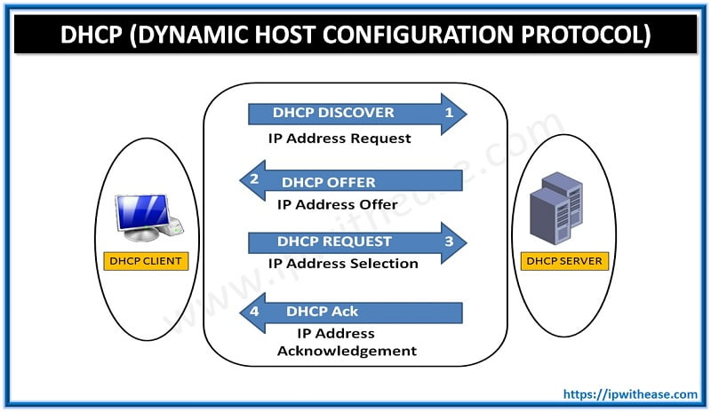
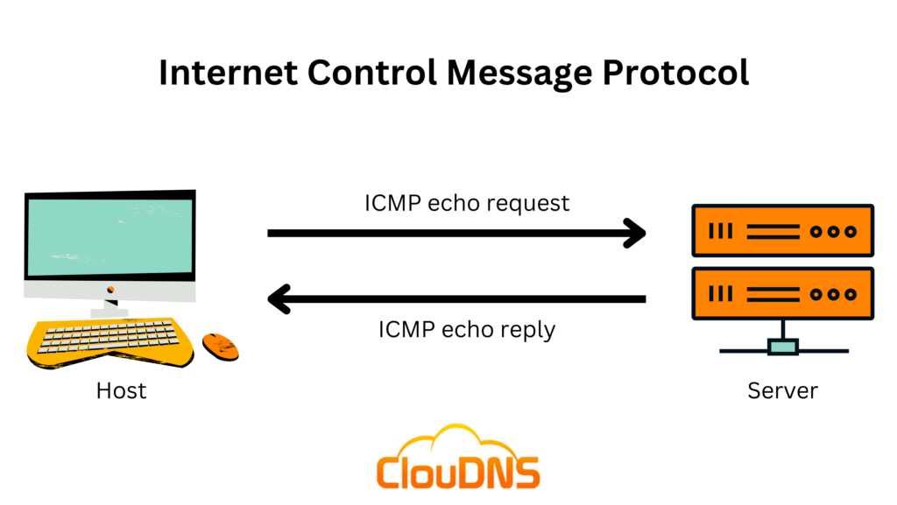
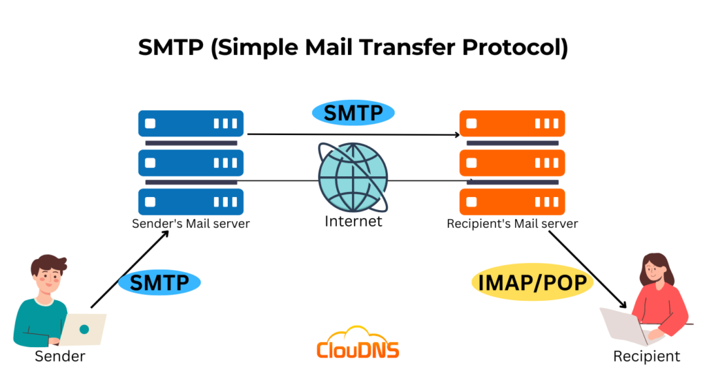

# UDP và TCP :

1. **UDP**

UDP (Giao thức gói dữ liệu người dùng) cho phép chúng ta tiếp cận một tiến trình cụ thể trên máy chủ đích này. UDP là một giao thức phi kết nối đơn giản hoạt động ở lớp vận chuyển, tức là lớp 4. Phi kết nối nghĩa là nó không cần thiết lập kết nối. UDP thậm chí không cung cấp cơ chế để biết gói tin đã được gửi hay chưa.

Địa chỉ IP xác định máy chủ; chúng ta cần một cơ chế để xác định quá trình gửi và nhận. Điều này có thể đạt được bằng cách sử dụng số cổng. Một số cổng sử dụng hai octet; do đó, nó nằm trong khoảng từ 1 đến 65535; cổng 0 được dành riêng. (Số 65535 được tính bằng biểu thức 2^16 - 1.)

Một ví dụ thực tế tương tự UDP là dịch vụ thư tiêu chuẩn, không có xác nhận giao hàng. Nói cách khác, không có gì đảm bảo rằng gói tin UDP đã được nhận thành công, tương tự như trường hợp gửi bưu kiện bằng thư tiêu chuẩn mà không có xác nhận giao hàng. Trong trường hợp thư tiêu chuẩn, chi phí rẻ hơn so với các tùy chọn giao hàng có xác nhận. Trong trường hợp UDP , tốc độ nhanh hơn so với giao thức truyền tải cung cấp "xác nhận".

**2. TCP**

TCP (Giao thức Điều khiển Truyền) là một giao thức truyền tải hướng kết nối. Nó sử dụng nhiều cơ chế khác nhau để đảm bảo việc truyền dữ liệu đáng tin cậy được gửi bởi các tiến trình khác nhau trên các máy chủ mạng. Giống như UDP , đây là giao thức lớp 4. Vì hướng kết nối, TCP yêu cầu thiết lập kết nối TCP trước khi bất kỳ dữ liệu nào có thể được gửi.

Trong TCP , mỗi octet dữ liệu có một số thứ tự; điều này giúp bên nhận dễ dàng xác định các gói tin bị mất hoặc trùng lặp. Mặt khác, bên nhận xác nhận việc nhận dữ liệu bằng một số xác nhận, chỉ rõ octet cuối cùng đã nhận.

Kết nối TCP được thiết lập bằng cái gọi là bắt tay ba bước. Hai cờ được sử dụng: SYN (Đồng bộ hóa) và ACK (Xác nhận). Các gói tin được gửi như sau:

- **Gói SYN**: Máy khách khởi tạo kết nối bằng cách gửi một gói SYN đến máy chủ. Gói này chứa số thứ tự ban đầu được máy khách chọn ngẫu nhiên.

- **Gói SYN-ACK** : Máy chủ phản hồi gói SYN bằng gói SYN-ACK, gói này sẽ thêm số thứ tự ban đầu do máy chủ chọn ngẫu nhiên.

- **Gói ACK**: Quá trình bắt tay ba chiều được hoàn tất khi máy khách gửi gói ACK để xác nhận đã nhận được gói SYN-ACK.

Tương tự như UDP , TCP xác định quá trình khởi tạo hoặc chờ (lắng nghe) kết nối bằng số cổng. Như đã nêu, số cổng hợp lệ nằm trong khoảng từ 1 đến 65535 vì nó sử dụng hai octet và cổng 0 được dành riêng.

# Đóng gói :

Trước khi kết thúc, điều quan trọng là phải giải thích một khái niệm quan trọng khác: đóng gói . Trong bối cảnh này, đóng gói đề cập đến quá trình mỗi lớp thêm một tiêu đề (và đôi khi là một phần đuôi) vào đơn vị dữ liệu đã nhận và gửi đơn vị "được đóng gói" xuống lớp bên dưới.

Đóng gói là một khái niệm thiết yếu vì nó cho phép mỗi lớp tập trung vào chức năng dự định của nó. Trong hình ảnh bên dưới, chúng ta có bốn bước sau:

Dữ liệu ứng dụng : Mọi thứ bắt đầu khi người dùng nhập dữ liệu họ muốn gửi vào ứng dụng. Ví dụ: bạn soạn email hoặc tin nhắn tức thời và nhấn nút gửi. Ứng dụng sẽ định dạng dữ liệu này và bắt đầu gửi theo giao thức ứng dụng được sử dụng, sử dụng lớp bên dưới nó, lớp vận chuyển.

Phân đoạn giao thức vận chuyển hoặc datagram : Lớp vận chuyển, chẳng hạn như TCP hoặc UDP , thêm thông tin tiêu đề thích hợp và tạo phân đoạn TCP (hoặc datagram UDP ). Phân đoạn này được gửi đến lớp bên dưới nó, lớp mạng.

Gói tin mạng : Tầng mạng, tức là tầng Internet, thêm tiêu đề IP vào phân đoạn TCP hoặc gói tin UDP đã nhận . Sau đó, gói tin IP này được gửi đến tầng bên dưới nó, tầng liên kết dữ liệu.

Khung liên kết dữ liệu : Ethernet hoặc WiFi nhận gói tin IP và thêm phần đầu và phần cuối thích hợp, tạo thành một khung .

Chúng ta bắt đầu với dữ liệu ứng dụng. Ở tầng vận chuyển, chúng ta thêm tiêu đề TCP hoặc UDP để tạo phân đoạn TCP hoặc gói tin UDP . Ở tầng mạng, chúng ta thêm tiêu đề IP phù hợp để tạo gói tin IP có thể được định tuyến qua Internet. Cuối cùng, chúng ta thêm tiêu đề và đuôi phù hợp để tạo khung WiFi hoặc Ethernet ở tầng liên kết.

Quá trình này phải được đảo ngược ở phía nhận cho đến khi dữ liệu ứng dụng được trích xuất.

# Telnet :

Giao thức TELNET (Mạng Teletype) là một giao thức mạng cho kết nối thiết bị đầu cuối từ xa. Nói một cách đơn giản hơn, telnet TELNET Client cho phép bạn kết nối và giao tiếp với một hệ thống từ xa và đưa ra các lệnh văn bản. Mặc dù ban đầu nó được sử dụng cho quản trị từ xa, nhưng chúng ta có thể sử dụng nó telnet để kết nối với bất kỳ máy chủ nào đang lắng nghe trên một số cổng TCP .

# DHCP: Cung cấp cho tôi cài đặt mạng của tôi

Bất cứ khi nào chúng ta muốn truy cập vào mạng, ít nhất chúng ta cần cấu hình những điều sau:
* Địa chỉ IP cùng với mặt nạ mạng con
* Bộ định tuyến (hoặc cổng)
* Máy chủ DNS

Bất cứ khi nào chúng ta kết nối thiết bị với một mạng mới, các cấu hình trên phải được thiết lập theo mạng mới. Việc cấu hình thủ công các thiết lập này là một lựa chọn tốt, đặc biệt là đối với máy chủ. Máy chủ không cần phải chuyển đổi mạng; bạn không cần phải mang theo bộ điều khiển miền và kết nối nó với WiFi của quán cà phê. Hơn nữa, các thiết bị khác cần kết nối với máy chủ và mong đợi tìm thấy chúng ở các địa chỉ IP cụ thể.

Việc tự động cấu hình các thiết bị được kết nối mang lại nhiều lợi ích. Thứ nhất, nó giúp chúng ta không phải cấu hình mạng thủ công; điều này cực kỳ quan trọng, đặc biệt là đối với các thiết bị di động. Thứ hai, nó giúp chúng ta tránh khỏi xung đột địa chỉ, tức là khi hai thiết bị được cấu hình với cùng một địa chỉ IP. Xung đột địa chỉ IP sẽ ngăn các máy chủ liên quan sử dụng tài nguyên mạng; điều này áp dụng cho cả tài nguyên cục bộ và Internet. Giải pháp nằm ở việc sử dụng Giao thức Cấu hình Máy chủ Động ( DHCP ). **DHCP là một giao thức cấp ứng dụng dựa trên UDP ; máy chủ lắng nghe trên cổng UDP 67, và máy khách gửi dữ liệu qua cổng UDP 68**. Điện thoại thông minh và máy tính xách tay của bạn được cấu hình để sử dụng DHCP theo mặc định.

DHCP thực hiện theo bốn bước: Khám phá, Đề xuất, Yêu cầu và Xác nhận (DORA):
* **DHCP Discover** : Máy khách phát đi thông báo DHCPDISCOVER để tìm kiếm máy chủ DHCP cục bộ nếu có.
* **DHCP Offer** : Máy chủ phản hồi bằng tin nhắn DHCPOFFER với địa chỉ IP có sẵn để máy khách chấp nhận.
* **Yêu cầu DHCP** : Máy khách phản hồi bằng tin nhắn DHCPREQUEST để cho biết rằng máy khách đã chấp nhận IP được cung cấp.
* **DHCP Acknowledge** : Máy chủ phản hồi bằng tin nhắn DHCPACK để xác nhận rằng địa chỉ IP được cung cấp hiện đã được gán cho máy khách này.

Khi kết thúc quá trình DHCP , thiết bị của chúng ta sẽ nhận được tất cả cấu hình cần thiết để truy cập mạng hoặc thậm chí là Internet. Cụ thể, chúng tôi kỳ vọng máy chủ DHCP đã cung cấp cho chúng ta những thông tin sau:
* Địa chỉ IP được thuê để truy cập tài nguyên mạng

* Cổng định tuyến các gói tin của chúng tôi ra bên ngoài mạng cục bộ

* Máy chủ DNS để phân giải tên miền

# ARP: Kết nối địa chỉ lớp 3 với địa chỉ lớp 2

**Giao thức Phân giải Địa chỉ (ARP) cho phép tìm địa chỉ MAC của một thiết bị khác trên Ethernet**. 
Trong ví dụ dưới đây, một máy chủ có địa chỉ IP 192.168.66.89 muốn giao tiếp với một hệ thống khác có cùng địa chỉ IP 192.168.66.1. Nó gửi một Yêu cầu ARP yêu cầu máy chủ có địa chỉ IP 192.168.66.1 phản hồi. Yêu cầu ARP được gửi từ địa chỉ MAC của máy yêu cầu đến địa chỉ MAC quảng bá, ff:ff:ff:ff:ff:ff như được hiển thị trong gói tin đầu tiên. ARP Reply đến ngay sau đó, và máy chủ có địa chỉ IP 192.168.66.1phản hồi với địa chỉ MAC của nó. Từ thời điểm này, hai máy chủ có thể trao đổi các khung dữ liệu lớp liên kết.

# ICMP: Xử lý sự cố mạng

Giao thức Tin nhắn Điều khiển Internet (ICMP) chủ yếu được sử dụng để chẩn đoán và báo cáo lỗi mạng. Hai lệnh phổ biến dựa trên ICMP đóng vai trò quan trọng trong việc khắc phục sự cố mạng và bảo mật mạng. Các lệnh đó là:

**ping**: Lệnh này sử dụng ICMP để kiểm tra kết nối với hệ thống đích và đo thời gian khứ hồi (RTT). Nói cách khác, nó có thể được sử dụng để xác định xem mục tiêu có hoạt động hay không và phản hồi của nó có thể đến được hệ thống của chúng tôi hay không.

**traceroute**: Lệnh này được gọi traceroute trên các hệ thống Linux và UNIX cũng như tracert trên các hệ thống MS Windows. Lệnh này sử dụng ICMP để khám phá tuyến đường từ máy chủ của bạn đến đích.

**Ping :**

Có thể bạn chưa từng chơi bóng bàn trước đây; tuy nhiên, nhờ ICMP, giờ đây bạn có thể chơi bóng bàn trên máy tính! ping Lệnh này sẽ gửi một Yêu cầu Phản hồi ICMP (Loại ICMP 8).

**Theo dõi tuyến đường(Traceroute) :**

Giao thức Internet có một trường gọi là Thời gian sống ( TTL ), cho biết số lượng bộ định tuyến tối đa mà một gói tin có thể đi qua trước khi bị loại bỏ. Bộ định tuyến sẽ giảm giá trị TTL của gói tin đi một trước khi gửi nó đi. Khi TTL về 0, bộ định tuyến sẽ loại bỏ gói tin và gửi thông báo ICMP Time Exceeded (Loại ICMP 11). (Trong ngữ cảnh này, "thời gian" được đo bằng số lượng bộ định tuyến, không phải giây.)

# Lộ trình(Routing) :

Các thuật toán định tuyến nằm ngoài phạm vi của phòng này; tuy nhiên, chúng tôi sẽ mô tả ngắn gọn một số giao thức định tuyến để bạn làm quen với tên của chúng:

* **OSPF (Open Shortest Path First)** : OSPF là một giao thức định tuyến cho phép các bộ định tuyến chia sẻ thông tin về cấu trúc mạng và tính toán các đường dẫn hiệu quả nhất để truyền dữ liệu. Giao thức này thực hiện điều này bằng cách cho các bộ định tuyến trao đổi thông tin cập nhật về trạng thái của các liên kết và mạng được kết nối. Nhờ đó, mỗi bộ định tuyến có một bản đồ mạng hoàn chỉnh và có thể xác định các tuyến đường tốt nhất để đến đích.
* **EIGRP (Giao thức Định tuyến Cổng Nội bộ Nâng cao)** : EIGRP là giao thức định tuyến độc quyền của Cisco, kết hợp các khía cạnh của nhiều thuật toán định tuyến khác nhau. Nó cho phép các bộ định tuyến chia sẻ thông tin về các mạng mà chúng có thể tiếp cận và chi phí (như băng thông hoặc độ trễ) liên quan đến các tuyến đường đó. Sau đó, các bộ định tuyến sử dụng thông tin này để chọn đường dẫn hiệu quả nhất cho việc truyền dữ liệu.
* **BGP (Giao thức Cổng Biên giới)** : BGP là giao thức định tuyến chính được sử dụng trên Internet. Nó cho phép các mạng khác nhau (như mạng của Nhà cung cấp Dịch vụ Internet) trao đổi thông tin định tuyến và thiết lập đường dẫn cho dữ liệu di chuyển giữa các mạng này. BGP giúp đảm bảo dữ liệu có thể được định tuyến hiệu quả trên Internet, ngay cả khi truyền qua nhiều mạng.
* **RIP (Giao thức Thông tin Định tuyến)** : RIP là một giao thức định tuyến đơn giản thường được sử dụng trong các mạng nhỏ. Các bộ định tuyến chạy RIP chia sẻ thông tin về các mạng mà chúng có thể tiếp cận và số lượng hop (bộ định tuyến) cần thiết để đến đó. Kết quả là, mỗi bộ định tuyến xây dựng một bảng định tuyến dựa trên thông tin này, chọn các tuyến đường có ít hop nhất để đến mỗi đích.

# NAT :

Như đã thảo luận trong phòng Khái niệm Mạng , chúng tôi đã tính toán rằng IPv4 có thể hỗ trợ tối đa bốn tỷ thiết bị. Với sự gia tăng số lượng thiết bị kết nối Internet, từ máy tính và điện thoại thông minh đến camera an ninh và máy giặt, rõ ràng là không gian địa chỉ IPv4 sẽ nhanh chóng cạn kiệt. Một giải pháp để giải quyết vấn đề cạn kiệt này là Chuyển đổi Địa chỉ Mạng (NAT).

Ý tưởng đằng sau NAT nằm ở việc sử dụng một địa chỉ IP công cộng để cung cấp quyền truy cập Internet cho nhiều địa chỉ IP riêng . Nói cách khác, nếu bạn đang kết nối một công ty với hai mươi máy tính, bạn có thể cung cấp quyền truy cập Internet cho tất cả hai mươi máy tính bằng cách sử dụng một địa chỉ IP công cộng duy nhất thay vì hai mươi địa chỉ IP công cộng. (Lưu ý: Về mặt kỹ thuật, số lượng địa chỉ IP luôn được biểu thị bằng lũy ​​thừa của hai. Chính xác hơn về mặt kỹ thuật, với NAT, bạn dành riêng hai địa chỉ IP công cộng thay vì ba mươi hai. Do đó, bạn sẽ tiết kiệm được ba mươi địa chỉ IP công cộng. )

Không giống như định tuyến, vốn là cách tự nhiên để định tuyến các gói tin đến máy chủ đích, các bộ định tuyến hỗ trợ NAT phải tìm cách theo dõi các kết nối đang diễn ra. Do đó, các bộ định tuyến hỗ trợ NAT duy trì một bảng chuyển đổi địa chỉ mạng giữa mạng nội bộ và mạng bên ngoài. Thông thường, mạng nội bộ sẽ sử dụng dải địa chỉ IP riêng, trong khi mạng bên ngoài sẽ sử dụng địa chỉ IP công cộng.

# DNS: Ghi nhớ địa ch

Bạn có nhớ địa chỉ IP của các trang web yêu thích của mình không? Trừ khi đó là địa chỉ IP riêng của một thiết bị cục bộ, không ai cần phải lo lắng về việc ghi nhớ địa chỉ IP. Điều này một phần là nhờ Hệ thống Tên miền ( DNS ), chịu trách nhiệm ánh xạ chính xác tên miền với địa chỉ IP.

DNS hoạt động ở Lớp Ứng dụng, tức là Lớp 7 của mô hình OSI ISO. Lưu lượng DNS sử dụng cổng UDP 53 theo mặc định và cổng TCP 53 làm cổng dự phòng mặc định. Có nhiều loại bản ghi DNS ; tuy nhiên, trong bài tập này, chúng ta sẽ tập trung vào bốn loại sau:

* **Bản ghi A** : Bản ghi A (Địa chỉ) ánh xạ tên máy chủ thành một hoặc nhiều địa chỉ IPv4. Ví dụ: bạn có thể thiết lập example.com để phân giải thành 172.17.2.172.
* **Bản ghi AAAA** : Bản ghi AAAA tương tự như Bản ghi A, nhưng dành cho IPv6. Lưu ý rằng nó là AAAA (quad-A), vì AA và AAA dùng để chỉ dung lượng pin; hơn nữa, AAA dùng để chỉ Xác thực, Ủy quyền và Kế toán ; cả hai đều không thuộc DNS .
* **Bản ghi CNAME** : Bản ghi CNAME (Tên chuẩn) ánh xạ một tên miền sang một tên miền khác. Ví dụ: www.example.com có thể được ánh xạ đến example.com hoặc thậm chí đến example.org.
* **Bản ghi MX** : Bản ghi MX (Trao đổi thư) chỉ định máy chủ thư chịu trách nhiệm xử lý email cho một tên miền.

Nói cách khác, khi bạn nhập example.com vào trình duyệt, trình duyệt sẽ cố gắng phân giải tên miền này bằng cách truy vấn máy chủ DNS để tìm bản ghi A. Tuy nhiên, khi bạn cố gắng gửi email đến test@example.com, máy chủ thư sẽ truy vấn máy chủ DNS để tìm bản ghi MX.

Nếu bạn muốn tra cứu địa chỉ IP của một tên miền từ dòng lệnh, bạn có thể sử dụng một công cụ như nslookup.

# WHOIS :

Bạn có thể tra cứu hồ sơ WHOIS của bất kỳ tên miền đã đăng ký nào bằng một trong các dịch vụ trực tuyến hoặc thông qua công cụ dòng lệnh whois, có sẵn trên hệ thống Linux , cùng nhiều công cụ khác. Đúng như dự kiến, hồ sơ WHOIS cung cấp thông tin về chủ thể đã đăng ký tên miền, bao gồm tên, số điện thoại, email và địa chỉ. Trong ảnh chụp màn hình bên dưới, bạn có thể thấy thời điểm hồ sơ được tạo lần đầu và thời điểm cập nhật lần cuối. Ngoài ra, bạn có thể tìm thấy tên, địa chỉ, số điện thoại và email của người đăng ký.

# HTTP(S) : Truy cập Web

Khi khởi động trình duyệt, bạn chủ yếu sử dụng giao thức HTTP và HTTPS. HTTP là viết tắt của Hypertext Transfer Protocol (Giao thức truyền siêu văn bản); chữ S trong HTTPS là viết tắt của Secure (Bảo mật). Giao thức này dựa trên TCP và xác định cách trình duyệt web của bạn giao tiếp với máy chủ web.

Một số lệnh hoặc phương thức mà trình duyệt web của bạn thường gửi tới máy chủ web là:

* GET lấy dữ liệu từ máy chủ, chẳng hạn như tệp HTML hoặc hình ảnh.
* POST cho phép chúng ta gửi dữ liệu mới tới máy chủ, chẳng hạn như gửi biểu mẫu hoặc tải tệp lên.
* PUT được sử dụng để tạo tài nguyên mới trên máy chủ và cập nhật và ghi đè thông tin hiện có.
* DELETE, như tên gọi của nó, được sử dụng để xóa một tệp hoặc tài nguyên được chỉ định trên máy chủ.

HTTP và HTTPS thường sử dụng cổng TCP 80 và 443, ít phổ biến hơn là các cổng khác như 8080 và 8443.

# FTP : Truyền tệp

Không giống như HTTP , được thiết kế để truy xuất các trang web, Giao thức Truyền Tệp ( FTP ) được thiết kế để truyền tệp. Do đó, FTP rất hiệu quả trong việc truyền tệp và khi tất cả các điều kiện đều như nhau, nó có thể đạt tốc độ cao hơn HTTP .

Các lệnh ví dụ được định nghĩa bởi giao thức FTP là:

* **USER** được sử dụng để nhập tên người dùng
* **PASS** được sử dụng để nhập mật khẩu
* **RETR(lấy)** được sử dụng để tải xuống tệp từ máy chủ FTP tới máy khách.
* **STOR(store)** được sử dụng để tải tệp từ máy khách lên máy chủ FTP .

Máy chủ FTP lắng nghe trên cổng TCP 21 theo mặc định; việc truyền dữ liệu được thực hiện thông qua một kết nối khác từ máy khách đến máy chủ.

# SMTP : Gửi email

Giống như việc duyệt web và tải xuống tệp, việc gửi email cũng cần có giao thức riêng. Giao thức Truyền Thư Đơn giản ( SMTP ) xác định cách máy khách thư giao tiếp với máy chủ thư và cách máy chủ thư giao tiếp với máy chủ thư khác.

Giao thức SMTP tương tự như khi bạn đến bưu điện địa phương để gửi một gói hàng. Bạn chào nhân viên, cho họ biết địa điểm bạn muốn gửi gói hàng và cung cấp thông tin người gửi trước khi giao gói hàng. Tùy thuộc vào quốc gia bạn đang ở, bạn có thể được yêu cầu xuất trình chứng minh thư. Quy trình này không khác mấy so với một phiên SMTP .

Chúng ta hãy cùng tìm hiểu một số lệnh mà máy khách thư của bạn sử dụng khi chuyển email đến máy chủ SMTP :

* **HELO** hoặc **EHLO** khởi tạo phiên SMTP
* **MAIL FROM** chỉ định địa chỉ email của người gửi
* **RCPT TO** chỉ định địa chỉ email của người nhận
* **DATA** chỉ ra rằng máy khách sẽ bắt đầu gửi nội dung của tin nhắn email
* **.** được gửi trên một dòng riêng để chỉ ra sự kết thúc của tin nhắn email

# POP3 : Nhận email

Bạn đã nhận được một email và muốn tải xuống máy khách thư cục bộ của mình. Giao thức Bưu điện phiên bản 3 ( POP3 ) được thiết kế để cho phép máy khách giao tiếp với máy chủ thư và nhận email.

Không đi sâu vào chi tiết kỹ thuật, một ứng dụng email sẽ gửi thư dựa trên SMTP và nhận chúng bằng POP3 . SMTP tương tự như việc bạn đưa phong bì hoặc bưu kiện đến bưu điện, còn POP3 tương tự như việc kiểm tra hộp thư địa phương của bạn để tìm thư hoặc bưu kiện mới.

Một số lệnh POP3 phổ biến là:

* **USER username** xác định người dùng
* **PASS password** cung cấp mật khẩu của người dùng
* **STAT** yêu cầu số lượng tin nhắn và tổng kích thước
* **LIST** liệt kê tất cả các tin nhắn và kích thước của chúng
* **RETR <message\_number>** lấy lại tin nhắn đã chỉ định
* **DELE <message\_number>** đánh dấu một tin nhắn để xóa
* **QUIT** kết thúc phiên POP3 bằng cách áp dụng các thay đổi, chẳng hạn như xóa

# IMAP : Đồng bộ hóa email

POP3 là đủ khi làm việc trên một thiết bị, ví dụ như ứng dụng email yêu thích của bạn trên máy tính để bàn. Tuy nhiên, nếu bạn muốn kiểm tra email từ máy tính để bàn ở cơ quan và từ máy tính xách tay hoặc điện thoại thông minh thì sao? Trong trường hợp này, bạn cần một giao thức cho phép đồng bộ hóa thư thay vì xóa thư sau khi nhận. Một giải pháp để duy trì hộp thư được đồng bộ hóa trên nhiều thiết bị là Giao thức Truy cập Thư Internet ( IMAP ).

IMAP cho phép đồng bộ hóa các thư đã đọc, đã di chuyển và đã xóa. IMAP khá tiện lợi khi bạn kiểm tra email qua nhiều máy khách. Không giống như POP3 , vốn có xu hướng giảm thiểu dung lượng lưu trữ máy chủ khi email được tải xuống và xóa khỏi máy chủ từ xa, IMAP có xu hướng sử dụng nhiều dung lượng lưu trữ hơn vì email được lưu trữ trên máy chủ và được đồng bộ hóa trên các máy khách email.

Các lệnh giao thức IMAP phức tạp hơn các lệnh giao thức POP3 . Chúng tôi liệt kê một vài ví dụ dưới đây:

* **LOGIN username password** xác thực người dùng
* **SELECT mailbox** chọn thư mục hộp thư để làm việc
* **FETCH <mail\_number> <data\_item\_name>** Ví dụ fetch 3 body\[] để lấy tin nhắn số 3, tiêu đề và nội dung.
* **MOVE sequence\_set mailbox** di chuyển các tin nhắn đã chỉ định đến hộp thư khác
* **COPY <sequence\_set> <data\_item\_name>** sao chép các tin nhắn đã chỉ định vào hộp thư khác
* **LOGOUT** đăng xuất

# TLS

TLS là một giao thức mật mã hoạt động ở tầng vận chuyển của mô hình OSI. Nó cho phép giao tiếp an toàn giữa máy khách và máy chủ qua một mạng không an toàn. "An toàn" ở đây có nghĩa là bảo mật và toàn vẹn; TLS đảm bảo rằng không ai có thể đọc hoặc sửa đổi dữ liệu được trao đổi. Hãy dành một phút để suy nghĩ về việc mua sắm trực tuyến, giao dịch ngân hàng trực tuyến, hoặc thậm chí nhắn tin và email trực tuyến sẽ như thế nào nếu không thể đảm bảo tính bảo mật và toàn vẹn của các gói tin mạng. Nếu không có TLS, chúng ta sẽ không thể sử dụng Internet cho nhiều ứng dụng hiện đang là một phần trong thói quen hàng ngày của chúng ta.

Ngày nay, hàng chục giao thức đã được nâng cấp bảo mật chỉ với việc bổ sung TLS. Ví dụ bao gồm HTTP , DNS , MQTT và SIP, nay đã trở thành HTTPS, DoT ( DNS qua TLS), MQTTS và SIPS, trong đó chữ "S" được thêm vào là viết tắt của Secure (Bảo mật) do sử dụng SSL/TLS. Trong các bài tập sau, chúng ta sẽ tìm hiểu về HTTPS, SMTPS, POP3S và IMAPS.

# HTTPS

**HTTP**

HTTP dựa trên TCP và mặc định sử dụng cổng 80. Chúng ta cũng đã thấy cách tất cả lưu lượng HTTP được gửi dưới dạng văn bản thuần túy để bất kỳ ai cũng có thể chặn và giám sát. Ảnh chụp màn hình bên dưới được chụp từ phòng trước, cho thấy rõ cách kẻ tấn công có thể dễ dàng đọc được tất cả lưu lượng được trao đổi giữa máy khách và máy chủ.

Các bước phổ biến nhất trước khi trình duyệt web có thể yêu cầu một trang qua HTTP . Sau khi phân giải tên miền thành địa chỉ IP, máy khách sẽ thực hiện hai bước sau:

Thiết lập bắt tay ba chiều TCP với máy chủ mục tiêu

Giao tiếp bằng giao thức HTTP ; ví dụ, đưa ra các yêu cầu HTTP , chẳng hạn như GET / HTTP/1.1

**HTTP qua TLS**

HTTPS là viết tắt của Hypertext Transfer Protocol Secure (Giao thức Truyền Siêu văn bản An toàn). Về cơ bản, nó là HTTP qua TLS. Do đó, việc yêu cầu một trang qua HTTPS sẽ yêu cầu ba bước sau (sau khi phân giải tên miền):

Thiết lập bắt tay ba chiều TCP với máy chủ mục tiêu

Thiết lập phiên TLS

Giao tiếp bằng giao thức HTTP ; ví dụ, đưa ra các yêu cầu HTTP , chẳng hạn như GET / HTTP/1.1

Ảnh chụp màn hình bên dưới cho thấy một phiên TCP được thiết lập trong ba gói tin đầu tiên, được đánh dấu bằng 1. Sau đó, một số gói tin

**Nhận khóa mã hóa**

Việc thêm TLS vào HTTP dẫn đến việc tất cả các gói tin đều được mã hóa. Chúng ta không thể xem nội dung của các gói tin được trao đổi trừ khi có quyền truy cập vào khóa riêng. Mặc dù khả năng chúng ta có quyền truy cập vào các khóa được sử dụng để mã hóa trong phiên TLS là rất thấp, chúng tôi đã lặp lại các ảnh chụp màn hình ở trên sau khi cung cấp khóa giải mã cho Wireshark. Quá trình bắt tay TCP và TLS không thay đổi; sự khác biệt chính bắt đầu từ giao thức HTTP được đánh dấu 3. Ví dụ: chúng ta có thể thấy khi máy khách phát hành lệnh GET.

Điểm mấu chốt là TLS cung cấp bảo mật cho HTTP mà không yêu cầu bất kỳ thay đổi nào trong các giao thức tầng thấp hơn hoặc tầng cao hơn. Nói cách khác, TCP và IP không bị thay đổi, trong khi HTTP được gửi qua TLS theo cách nó được gửi qua TCP .

# SMTPS, POP3S và IMAPS

Việc thêm TLS vào SMTP , POP3 và IMAP cũng không khác gì việc thêm TLS vào HTTP . Tương tự như cách HTTP được thêm chữ S (viết tắt của Secure ) và trở thành HTTPS, SMTP , POP3 và IMAP lần lượt trở thành SMTPS, POP3S và IMAPS. Việc sử dụng các giao thức này qua TLS cũng không khác gì việc sử dụng HTTP qua TLS; do đó, hầu hết các điểm trong phần thảo luận về HTTPS đều áp dụng cho các giao thức này.

Protocol    ->     Port

HTTP        ->     80

HTTPS         ->   443

SMTP         ->    25

SMTPS        ->  465 và 587

POP3        ->     110

POP3S         ->   995

IMAP         ->    143

IMAPS       ->     993

# SSH

OpenSSH mang lại nhiều lợi ích. Chúng tôi sẽ liệt kê một vài điểm chính:

* **Xác thực an toàn** : Bên cạnh xác thực dựa trên mật khẩu, SSH hỗ trợ khóa công khai và xác thực hai yếu tố.

* **Bảo mật** : OpenSSH cung cấp mã hóa đầu cuối, bảo vệ chống nghe lén. Hơn nữa, nó còn thông báo cho bạn về các khóa máy chủ mới để bảo vệ chống lại các cuộc tấn công trung gian.

* **Tính toàn vẹn** : Ngoài việc bảo vệ tính bảo mật của dữ liệu trao đổi, mật mã còn bảo vệ tính toàn vẹn của lưu lượng.

* **Đường hầm** : SSH có thể tạo một "đường hầm" an toàn để định tuyến các giao thức khác qua SSH . Thiết lập này dẫn đến một kết nối giống như VPN .

* **Chuyển tiếp X11** : Nếu bạn kết nối với hệ thống giống Unix có giao diện người dùng đồ họa, SSH cho phép bạn sử dụng ứng dụng đồ họa qua mạng.

Bạn sẽ ra lệnh ssh username@hostname kết nối đến máy chủ SSH . Nếu tên người dùng trùng với tên người dùng đã đăng nhập, bạn chỉ cần ssh hostname. Sau đó, bạn sẽ được yêu cầu nhập mật khẩu; tuy nhiên, nếu sử dụng xác thực khóa công khai, bạn sẽ được đăng nhập ngay lập tức.

# SFTP và FTPS

SFTP là viết tắt của Giao thức Truyền Tệp SSH (SSH File Transfer Protocol) và cho phép truyền tệp an toàn. SFTP là một phần của bộ giao thức SSH và dùng chung cổng 22. Nếu được bật trong cấu hình máy chủ OpenSSH, bạn có thể kết nối bằng lệnh như sftp username@hostname. Sau khi đăng nhập, bạn có thể dùng lệnh như get filename và put filename để tải xuống và tải lên tệp tương ứng. Nhìn chung, các lệnh SFTP tương tự Unix và có thể khác với lệnh FTP .

Không nên nhầm lẫn SFTP với FTPS. Bạn hoàn toàn đúng khi cho rằng FTPS là viết tắt của Giao thức Truyền Tệp Bảo mật (File Transfer Protocol Secure). FTPS được bảo mật như thế nào? Đúng vậy, bạn hoàn toàn đúng khi cho rằng nó được bảo mật bằng TLS, giống như HTTPS. Trong khi FTP sử dụng cổng 21, FTPS thường sử dụng cổng 990. Nó yêu cầu thiết lập chứng chỉ, và việc cho phép truy cập qua tường lửa nghiêm ngặt có thể gặp khó khăn vì nó sử dụng các kết nối riêng biệt để kiểm soát và truyền dữ liệu.

Việc thiết lập máy chủ SFTP cũng dễ dàng như việc bật tùy chọn trong máy chủ OpenSSH. Giống như HTTPS, SMTPS, POP3S, IMAPS và các giao thức khác dựa trên TLS để bảo mật, FTPS yêu cầu chứng chỉ TLS phù hợp để chạy an toàn.

# Mạng riêng ảo (VPN)

Hãy xem xét một công ty có văn phòng ở nhiều vị trí địa lý khác nhau. Liệu công ty này có thể kết nối tất cả văn phòng và địa điểm của mình với chi nhánh chính để mọi thiết bị đều có thể truy cập tài nguyên dùng chung như thể đang ở chi nhánh chính không? Câu trả lời là có; hơn nữa, giải pháp tiết kiệm nhất sẽ là thiết lập mạng riêng ảo ( VPN ) sử dụng cơ sở hạ tầng Internet. Trọng tâm ở đây là chữ V (Virtual) trong VPN .

Khi Internet được thiết kế, bộ giao thức TCP /IP tập trung vào việc phân phối các gói tin. Ví dụ, nếu một bộ định tuyến ngừng hoạt động, các giao thức định tuyến có thể điều chỉnh và chọn một tuyến đường khác để gửi các gói tin của chúng. Nếu một gói tin không được xác nhận, TCP có các cơ chế tích hợp để phát hiện tình huống này và gửi lại. Tuy nhiên, không có cơ chế nào được thiết lập để đảm bảo rằng tất cả dữ liệu ra vào máy tính được bảo vệ khỏi bị tiết lộ và thay đổi. Một giải pháp phổ biến là thiết lập kết nối VPN . Trọng tâm ở đây là chữ P (Private) trong VPN .

Hầu hết các công ty đều yêu cầu trao đổi thông tin "riêng tư" trong mạng ảo của họ. Vì vậy, VPN cung cấp một giải pháp rất tiện lợi và tương đối tiết kiệm chi phí. Yêu cầu chính là kết nối Internet và máy chủ VPN cùng máy khách.

Sau khi đường hầm VPN được thiết lập, tất cả lưu lượng truy cập Internet của chúng ta thường sẽ được định tuyến qua kết nối VPN , tức là thông qua đường hầm VPN . Do đó, khi chúng ta cố gắng truy cập một dịch vụ Internet hoặc ứng dụng web, họ sẽ không thấy địa chỉ IP công khai của chúng ta mà là địa chỉ IP của máy chủ VPN . Đây là lý do tại sao một số người dùng Internet kết nối qua VPN để vượt qua các hạn chế về địa lý. Hơn nữa, ISP địa phương sẽ chỉ thấy lưu lượng được mã hóa, điều này hạn chế khả năng kiểm duyệt truy cập Internet của họ.

Nói cách khác, nếu người dùng kết nối với máy chủ VPN tại Nhật Bản, họ sẽ được hiển thị trên máy chủ họ truy cập như thể đang ở Nhật Bản. Các máy chủ này sẽ tùy chỉnh trải nghiệm của họ cho phù hợp, chẳng hạn như chuyển hướng họ đến phiên bản tiếng Nhật của dịch vụ. Ảnh chụp màn hình bên dưới hiển thị trang Google Tìm kiếm sau khi kết nối với máy chủ VPN tại Nhật Bản.

Cuối cùng, mặc dù trong nhiều trường hợp, người ta sẽ thiết lập kết nối VPN để định tuyến toàn bộ lưu lượng qua đường hầm VPN , nhưng một số kết nối VPN lại không làm như vậy. Máy chủ VPN có thể được cấu hình để cho phép bạn truy cập vào mạng riêng nhưng không phải để định tuyến lưu lượng của bạn. Hơn nữa, một số máy chủ VPN làm rò rỉ địa chỉ IP thực của bạn, mặc dù chúng được kỳ vọng sẽ định tuyến toàn bộ lưu lượng của bạn qua VPN . Tùy thuộc vào lý do bạn sử dụng kết nối VPN , bạn có thể cần chạy thêm một vài bài kiểm tra, chẳng hạn như kiểm tra rò rỉ DNS .

Cuối cùng, một số quốc gia coi việc sử dụng VPN là bất hợp pháp và thậm chí có thể bị phạt. Vui lòng kiểm tra luật pháp và quy định địa phương trước khi sử dụng VPN, đặc biệt là khi đi du lịch.