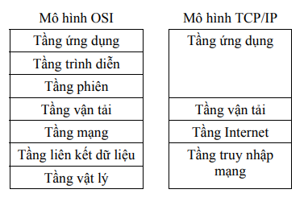

# 1. Nguyên lý chung của kiến trúc phân tầng

• Mục đích: Việc phân tầng giúp chuyên môn hóa các chức năng, cho phép thay đổi công nghệ ở một tầng mà không ảnh hưởng đến các tầng khác, và giúp các hệ thống khác nhau có thể giao tiếp được với nhau,.

• Quy tắc hoạt động: Mỗi tầng sử dụng dịch vụ của tầng bên dưới và cung cấp dịch vụ cho tầng bên trên. Dữ liệu không truyền trực tiếp ngang hàng (trừ tầng vật lý), mà phải đi xuống các tầng dưới ở máy gửi và đi lên các tầng trên ở máy nhận.

# 2. Những lưu ý về Mô hình OSI (7 tầng)

Đây là mô hình tham chiếu lý thuyết để các hệ thống mở kết nối với nhau.

• Tầng 7: Ứng dụng (Application): Là tầng cao nhất, nơi tạo ra dữ liệu thực sự và cung cấp giao diện cho người dùng (như Web, Email).

• Tầng 6: Trình diễn (Presentation): Chịu trách nhiệm về cú pháp và ngữ nghĩa. Các chức năng quan trọng cần nhớ là mã hóa/giải mã (để bảo mật), nén/giải nén (để giảm dung lượng) và chuyển đổi định dạng dữ liệu để các hệ thống khác nhau hiểu được nhau.

• Tầng 5: Phiên (Session): Kiểm soát hội thoại (bán song công hoặc song công) và đồng bộ hóa. Điểm lưu ý là khả năng chèn các điểm đồng bộ để nếu lỗi xảy ra, chỉ cần truyền lại từ điểm kiểm tra gần nhất thay vì toàn bộ dữ liệu.

• Tầng 4: Vận tải (Transport): Đảm bảo truyền tin tin cậy giữa các tiến trình (process-to-process). Chức năng chính gồm phân đoạn/tái hợp dữ liệu, kiểm soát lỗi và kiểm soát lưu lượng.

• Tầng 3: Mạng (Network): Chuyển dữ liệu giữa các thiết bị đầu cuối (host-to-host) qua liên mạng. Sử dụng địa chỉ logic (như IP) và thực hiện định tuyến (tìm đường đi tối ưu).

• Tầng 2: Liên kết dữ liệu (Data Link): Đảm bảo truyền tin tin cậy giữa hai thiết bị kết nối vật lý trực tiếp. Sử dụng địa chỉ vật lý (MAC). Đơn vị dữ liệu là Khung (Frame). Tầng này cũng kiểm soát truy cập đường truyền khi nhiều thiết bị dùng chung môi trường.

• Tầng 1: Vật lý (Physical): Truyền dòng bit (0 và 1) qua môi trường vật lý. Quan tâm đến các đặc tả về điện, cơ, quang, tốc độ truyền dẫn và chế độ truyền (đơn công, song công).

# 3. Những lưu ý về Mô hình TCP/IP (4 tầng)

Đây là mô hình giao thức thực tế của Internet, ra đời trước OSI.

**Tầng 4: Ứng dụng (Application):**
    ◦ Bao gồm chức năng của 3 tầng trên cùng trong OSI (Ứng dụng, Trình diễn, Phiên).
    ◦ Các giao thức phổ biến: HTTP (Web), FTP (truyền file), SMTP (Email), DNS (tên miền).
    ◦ Giao tiếp với tầng vận tải qua các Cổng (Port).

**Tầng 3: Vận tải (Transport):**
    ◦ Hai giao thức cốt lõi cần nhớ:
        ▪ TCP: Có hướng (kết nối trước khi truyền), tin cậy (đảm bảo không lỗi, đúng thứ tự), có kiểm soát tắc nghẽn.
        ▪ UDP: Vô hướng (không kết nối), không tin cậy (nỗ lực tối đa), tốc độ nhanh, dùng cho ứng dụng thời gian thực hoặc không yêu cầu độ chính xác tuyệt đối,.
    ◦ Đơn vị dữ liệu: Đoạn (Segment).

**Tầng 2: Internet (tương đương Tầng Mạng OSI):**
    ◦ Sử dụng giao thức IP để định tuyến và đóng gói.
    ◦ Cần lưu ý các giao thức hỗ trợ: ICMP (báo lỗi/điều khiển), ARP (tìm địa chỉ MAC từ IP), RARP (tìm IP từ MAC),.
    ◦ Đơn vị dữ liệu: Gói tin (Packet).

**Tầng 1: Truy nhập mạng (Network Access):**
    ◦ Tương ứng với Tầng Vật lý và Liên kết dữ liệu của OSI.
    ◦ Chịu trách nhiệm truyền dữ liệu thực tế trên môi trường vật lý (Ethernet, Wi-Fi...).
    ◦ Đơn vị dữ liệu: Khung (Frame).

# 4. So sánh và Mối quan hệ giữa các tầng

**Đóng gói dữ liệu (Encapsulation):**
    ◦ Tại máy gửi: Dữ liệu đi từ tầng trên xuống tầng dưới. Mỗi tầng thêm thông tin điều khiển (Header) vào dữ liệu nhận được.
    ◦ Tại máy nhận: Dữ liệu đi từ dưới lên trên, mỗi tầng bóc tách Header tương ứng để lấy dữ liệu,.
    ◦ Tên gọi đơn vị dữ liệu (PDU) thay đổi theo tầng trong TCP/IP: Dữ liệu (Ứng dụng) → Đoạn (Vận tải) → Gói tin (Internet) → Khung (Truy nhập mạng).

**Địa chỉ hóa:**
    ◦ Tầng Ứng dụng: Dùng tên miền (dễ nhớ với người dùng).
    ◦ Tầng Vận tải: Dùng Số hiệu cổng (Port) để phân biệt các tiến trình/ứng dụng trên cùng một máy (VD: Web dùng port 80, Mail dùng port 25),.
    ◦ Tầng Mạng/Internet: Dùng Địa chỉ IP (Logic) để định danh thiết bị trên mạng và định tuyến,.
    ◦ Tầng Liên kết/Truy nhập mạng: Dùng Địa chỉ MAC (Vật lý) để chuyển dữ liệu trong mạng nội bộ.

**Sự tương quan:**
    ◦ Mô hình TCP/IP gộp tầng 5, 6, 7 của OSI thành một tầng Ứng dụng duy nhất.
    ◦ Mô hình TCP/IP gộp tầng 1, 2 của OSI thành tầng Truy nhập mạng.
    ◦ Một số giao thức như ARP, RARP nằm giữa tầng Internet và tầng Liên kết dữ liệu để chuyển đổi địa chỉ.